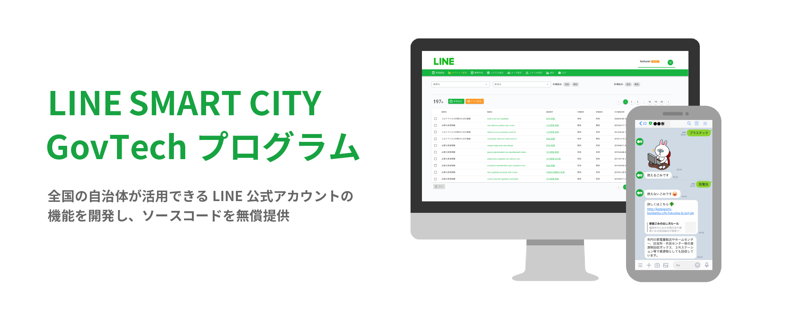
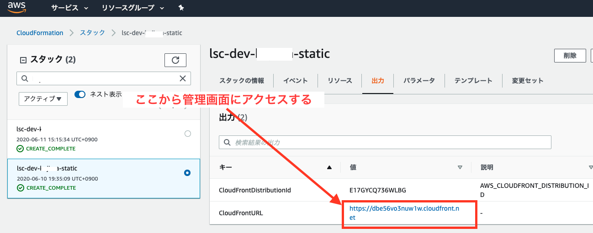
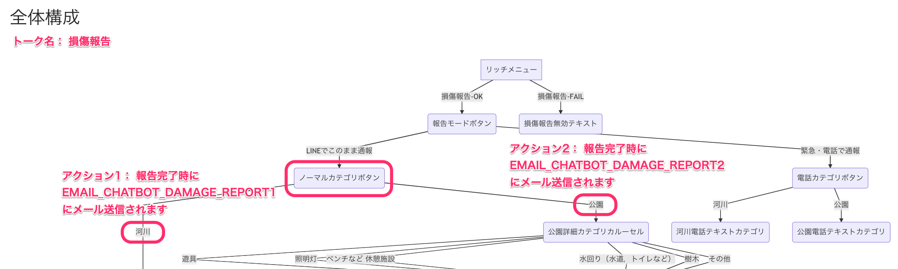

# LINE SMART CITY


[](https://linefukuoka.co.jp/ja/project/smartcityproject/govtech/)

## 「LINE SMART CITY GovTechプログラム」とは？
「LINE SMART CITY GovTechプログラム」とは、LINE公式アカウント追加機能のソースコードを無償で提供するプログラムです。本プログラムのソースコードを活用することで、全国の自治体はより簡易にLINE公式アカウントへの追加機能の導入が可能です。詳しくは[「LINE Smart City GovTechプログラム」](https://linefukuoka.co.jp/ja/project/smartcityproject/govtech/)をご覧ください。

### 「LINE SMART CITY GovTechプログラム」で提供する４つの機能  

(1) セグメント配信  
(2) 申請/アンケート機能  
(3) FAQ機能－チャットボット形式応答  
(4) 管理機能 

## デモ環境

| No | 項目 | 詳細 | 備考 |
|---|---|---|---|
| 1 | 管理画面 | [管理画面デモ](https://admin.lsc.line-smartcity.com/) にログインしてご確認ください。 | ID: lsc-demo<br>Password: demo1234 |
| 2 | LINE公式アカウント | [LINE API Use Case](https://lineapiusecase.com/ja/usecase/govtech.html) をご参照ください。  | |

# デプロイ手順
構築時間の目安は **約50〜60分** です。以下の手順で環境構築を行なってください。

## 目次
- [1. 事前準備](#1-事前準備)
- [2. 構築手順](#2-構築手順)
    - [2-1. LINE連携](#2-1-line連携)
    - [2-2. 実行](#2-2実行)
    - [2-3. 管理画面](#2-3-管理画面)
- [3. 環境構築時のトラブルシューティング](#3-環境構築時のトラブルシューティング)

## 1. 事前準備
### 1-1. 実行環境

#### 推奨スペック

- メモリ割り当て : 7GB以上
    - 4GB程度またはそれ以下の場合、環境構築に失敗する可能性がございます

#### アプリケーション

以下のアプリケーションを、開発を行うローカル環境へインストールします。

| アプリケーション名 | 必須バージョン | 備考 |
|---|---|---|
| [Node.js](https://nodejs.org/ja/download/) | 14.x, 15.x | [npm バージョン7](https://docs.npmjs.com/cli/v7)以降の利用を推奨 |
| [Python](https://www.python.jp/install/install.html) | 3.8 | 複数バージョンを管理する場合、[pyenv](https://github.com/pyenv/pyenv) / [pyenv-win](https://github.com/pyenv-win/pyenv-win) の利用を推奨 |
| [AWS CLI](https://docs.aws.amazon.com/ja_jp/cli/latest/userguide/install-cliv2.html) | 2.0以上 ||
| [SAM CLI](https://docs.aws.amazon.com/ja_jp/serverless-application-model/latest/developerguide/serverless-sam-cli-install.html) | 1.0以上 ||

* Macの場合は `ターミナル`、Windowsの場合は [WSL 2](https://docs.microsoft.com/ja-jp/windows/wsl/) を立ち上げて作業を行ってください。
* pip ([macOS](https://www.python.jp/install/macos/pip.html) / [Windows](https://www.python.jp/install/windows/pip.html)) で必要なパッケージをインストールしてください。
```bash
$ pip install wheel setuptools
```

#### 推奨ブラウザ

管理画面の動作保証環境は、Chrome(最新版)のみとなります。


### 1-2. リポジトリのクローン

```
$ git clone git@github.com:linefukuoka/line-smart-city.git
```

### 1-3. AWSのプロファイル作成

「[AWSのプロファイル作成](./docs/AWS_CLI_CREATE_PROFILE.md)」をご参照ください。

## 2. 構築手順

### 2-1. LINE連携

#### 1. LINE Developersのチャネル作成

下記の手順に従って、LINE Developersの設定を行ってください。

* LINE Developers チャネル設定(Messaging API)
   * [スタック作成前の設定](./docs/LINE_MESSAGING_API_SETTINGS.md#1-スタック作成前の設定)
* LINE Developers チャネル設定(LINEログイン)
   * [スタック作成前の設定](./docs/LINE_LOGIN_SETTINGS.md#1-スタック作成前の設定)

なお、LINE DevelopersのMessaging APIチャネルから受信したMessaging APIイベントのうち、特定のイベントを任意の連携システムに転送することができます。詳細は [LINE Messaging API転送機能](./docs/LSC_FORWARD_MESSAGING_API_WEBHOOK.md) を参照ください。

#### 2. 設定情報の反映

「LINE SMART CITY GovTechプログラム」では、設定情報の管理に [AWS Secrets Manager](https://aws.amazon.com/jp/secrets-manager/)を利用しています。  
プロファイル名、環境名 (= AWSプロファイル名 + 開発者名など固有の値) はそれぞれ各自の環境に合った値に変更してください。

※ 環境名はカスタムドメイン設定を行う際、サブドメインに利用されます。  
例: `https://admin.環境名.line-smartcity.com`

**設定例**

| 用途 | プロファイル名 | 環境名 | 備考 |
|---|---|---|---|
| 本番 | lsc-fukuoka | lsc-fukuoka-prod | |
| ステージング | lsc-fukuoka-stg | lsc-fukuoka-stg | |
| 開発 | lsc-fukuoka-dev | lsc-fukuoka-dev-tanaka<br>lsc-fukuoka-dev-suzuki | |

1. シークレット作成  
   [環境構築スクリプト（`lsc.sh`）](./docs/LSC_COMMANDS.md#1-環境構築スクリプトについて)を使って、シークレットを作成します。
   
```bash
$ ./lsc.sh -e 環境名 -p プロファイル名 secrets create
```

2. シークレット修正

`deploy/secrets_manager/環境名.json` を開き、下記のキーを編集します。

| No | LINE OA | シークレットキー | 内容 | 備考 |
|:---|:---|:---|:---|:---|
| 1 | 本番/ステージング/開発 | LINEMESSAGING_CHANNEL_ACCESS_TOKEN | LINE Messaging APIのチャネルアクセストークン | |
| 2 | 本番/ステージング/開発 | LINEMESSAGING_CHANNEL_ID | LINE Messaging APIのチャネルID | |
| 3 | 本番/ステージング/開発 | LINEMESSAGING_CHANNEL_SECRET | LINE Messaging APIのチャネルシークレット | |
| 4 | サンドボックス | SB_LINEMESSAGING_CHANNEL_ACCESS_TOKEN | LINE Messaging APIのチャネルアクセストークン | ステージング/開発の場合、1と同じ値 |
| 5 | サンドボックス | SB_LINEMESSAGING_CHANNEL_ID | LINE Messaging APIのチャネルID | ステージング/開発の場合、2と同じ値 |
| 6 | サンドボックス | SB_LINEMESSAGING_CHANNEL_SECRET | LINE Messaging APIのチャネルシークレット | ステージング/開発の場合、3と同じ値 |
| 7 | 共通 | VUE_APP_LIFF_ID | LIFF アプリケーションのLIFF ID | |
| 8 | 共通 | SURVEY_LINELOGIN_CHANNEL_ID | LINEログインのチャネルID | |
| 9 | 共通 | SURVEY_LINELOGIN_CHANNEL_SECRET | LINEログインのチャネルシークレット | |
| 10 | 共通 | DISTRIBUTION_MSG_CHANNEL_ACCESS_TOKEN | LINE Messaging APIのチャネルアクセストークン | 1と同じ値 |
| 11 | 共通 | DISTRIBUTION_MSG_CHANNEL_SECRET | LINE Messaging APIのチャネルシークレット | 3と同じ値 |
| 12 | 共通 | DISTRIBUTION_TRIGGER_EMAIL | セグメント配信で利用する受信メールアドレス。「任意の文字 + `@環境名.ルートドメイン (example.com など)`」を入力 | 入力例：`mail@lsc-fukuoka-dev.line-smartcity.com`<br />入力しなかった場合、デプロイ時にデフォルト値`receive-mail@環境名.ルートドメイン`が設定されます<br />**カスタムドメインを有効にしていない場合は外部配信機能は利用できません** |
| 13 | 共通 | VUE_APP_MEMBERS_TAB | 会員帳票機能の有効・無効を切り替え | 有効にする場合`1`に変更 |

* 参考：Secrets Managerで設定している値の詳細は、「[環境変数](./docs/LSC_ENVIRONMENT_VARIABLES.md)」を確認してください。

3. シークレット反映  
jsonを編集後、下記を実行してシークレット更新します。
```bash
$ ./lsc.sh secrets update
```

### 2-2.実行

#### 1. AWS設定

カスタムドメインやメール連携の初期設定のため、Amazon Route53（以下、「Route53」）やAmazon SES （以下、「SES」）の設定を行います。[AWS設定](./docs/AWS_SETTINGS.md) をご参照ください。

#### 2. 初期構築
下記のコマンドを実行することで、AWS環境のデプロイを行います。
* 所要時間は約40〜50分です

```bash
$ ./lsc.sh deploy
```

* 下記オプションを使用することで、スタック削除保護を有効化します。（本番環境では有効化を推奨）
  
    * ```bash
      $ ./lsc.sh deploy --enable-termination-protection
      ```
    
* SAMのビルド途中でPython関係のエラーが出る場合は、[Docker](https://www.docker.com/products/docker-desktop)をインストールして起動し、`--useContainer`オプションを付けて実行してください。
  
    *  ```bash
       $ ./lsc.sh deploy --useContainer
       ```

* Lambdaのデプロイ途中でメモリ制限エラー `'MemorySize' value failed to satisfy constraint: Member must have value less than or equal to 3008` が発生した場合、`--work-around-lambda-memory-limit`オプションを付けて実行してください。

    *  ```bash
       $ ./lsc.sh deploy --work-around-lambda-memory-limit
       ```
    * メモリサイズを変更してデプロイする場合のシステム影響については、[--work-around-lambda-memory-limitオプション適用時の注意点](./docs/LSC_COMMANDS.md#--work-around-lambda-memory-limitオプション適用時の注意点)を参照ください。

* オプションの詳細は「[開発用コマンド一覧](./docs/LSC_COMMANDS.md#3-コマンド即座に実行)」をご確認ください。


#### 3. LINE Developersのチャネル設定変更
LINE Developersに戻り、下記の手順に従ってチャネルの設定を行ってください。

* [LINE Developers チャネル設定(Messaging API) > スタック作成後の設定](./docs/LINE_MESSAGING_API_SETTINGS.md#2-スタック作成後の設定)
* [LINE Developers チャネル設定(LINEログイン) > スタック作成後の設定](./docs/LINE_LOGIN_SETTINGS.md#2-スタック作成後の設定)

チャネルの設定完了後、下記コマンドを実行してLIFFアプリのビルド、デプロイを行います。

```bash
# LIFFのビルド、デプロイ
$ ./lsc.sh survey liff refresh
```

#### 4. SESの受信メールアドレス設定

* AWSコンソールにてSESを開いてメールアドレス設定を実施してください。
    * [SESの受信メールアドレス設定](./docs/AWS_SES_RECEIVING_EMAIL_SETTINGS.md)

### 2-3. 管理画面

#### 1. 管理画面のユーザー作成
管理画面の認証で使用するユーザーを作成します。下記を実行します。

```bash
$ ./lsc.sh users
```

* `select what to do` とメニューが出るので「Add」を選択します。
* `Input username` で、ログインするユーザー名を入力します。
    * 最低5文字以上
* `Input mail address` でメールアドレスを入力します（次のステップで設定したパスワードが送られてきます）
* `Input password` では、パスワードを英数字8文字以上で入力します。
* `Select Groups` でユーザーに追加するグループを選択します。
    * 上下キーで移動してスペースキーでグループ名を選択します。
    * デフォルトでは `Administrator:admins` が選択されています。（1.6.2以下のバージョンでは`admins` です）
    * 古いグループ名 `admins`, `members`, `guests`, `operators`, `develop` が存在する場合がありますが、非推奨のため選択しないようお願いします。
    * `Select Groups`の選択が完了後、Enterキーで確定します。
    * グループ名は「所属チーム名:付与権限」で構成されます。
    * 「所属チーム名」は業務における所属組織をイメージした要素です。（例：総務課、営業第一課、経理 など）
        * `Administrator`は管理者チームです。新規チームについては管理画面より追加ください。
    * 「付与権限」には以下の種類があります。
        * admins：すべての操作が可能
        * members：全体に影響を与える操作（システム設定、シナリオ切替、リッチメニュー切替）やユーザ管理等の操作以外
        * operators：外部委託を想定した操作権限を付与（帳票の登録内容閲覧や編集・カレンダーの予約枠数の閲覧など）
        * guests：基本的に読み取り権限のみ

#### 2. 管理画面へのアクセス

* AWSコンソールからCloudFormationにアクセスし、スタック名（環境名 + `-platform-static`）の出力タブにある`CloudFrontURL`にアクセスすると管理画面が見れます
* 「管理画面のユーザー作成」で作成したユーザー名・パスワードでログインします。


#### 3. シナリオ設定
LINE公式アカウントを利用できる状態にするため、シナリオ設定を行います。  
シナリオ設定については、「[管理画面 | シナリオ設定](./docs/LSC_ADMIN_SCENARIO_SETTINGS.md)」をご参照ください。

#### 4. 損傷報告先メールアドレスの設定
損傷報告先メールアドレスを設定します。

* 管理画面にログインする
* メニューより「システム設定 > AWS設定」を選択
* 以下項目を入力

| No | LINE OA | シークレットキー | 内容 | 備考 |
|:---|:---|:---|:---|:---|
| 1 | 共通 | EMAIL_CHATBOT_DAMAGE_REPORT1 | 損傷報告メールアドレス1 | シナリオ設定 「ノーマルカテゴリボタン」の「アクション1」完了時の送信先メールアドレス |
| 2 | 共通 | EMAIL_CHATBOT_DAMAGE_REPORT2 | 損傷報告メールアドレス2 | シナリオ設定 「ノーマルカテゴリボタン」の「アクション2」完了時の送信先メールアドレス |
| 3 | 共通 | EMAIL_CHATBOT_DAMAGE_REPORT3 | 損傷報告メールアドレス3 | シナリオ設定 「ノーマルカテゴリボタン」の「アクション3」完了時の送信先メールアドレス |
| 4 | 共通 | EMAIL_CHATBOT_DAMAGE_REPORT4 | 損傷報告メールアドレス4 | シナリオ設定 「ノーマルカテゴリボタン」の「アクション4」完了時の送信先メールアドレス |

* 「保存」ボタンをクリックして、損傷報告先メールアドレスを保存する

#### 損傷報告先メールアドレスの利用箇所
* EMAIL_CHATBOT_DAMAGE_REPORT1〜4は、シナリオ設定 「ノーマルカテゴリボタン」のアクション1〜4で利用されます。

##### 例）
シナリオ設定 > サンドボックス > 編集 > 「トーク名：損傷報告」



## 3. 環境構築時のトラブルシューティング
「[環境構築時のトラブルシューティング](./docs/DEPLOY_TROUBLESHOOTING.md)」をご参照ください。  

# 今後のリリース予定
「[LINE SMART CITY GovTechプログラム ロードマップ](https://github.com/linefukuoka/line-smart-city-docs/projects/1)」をご参照ください。  
今後も随時機能が追加されていく予定ですので、ご期待ください。
