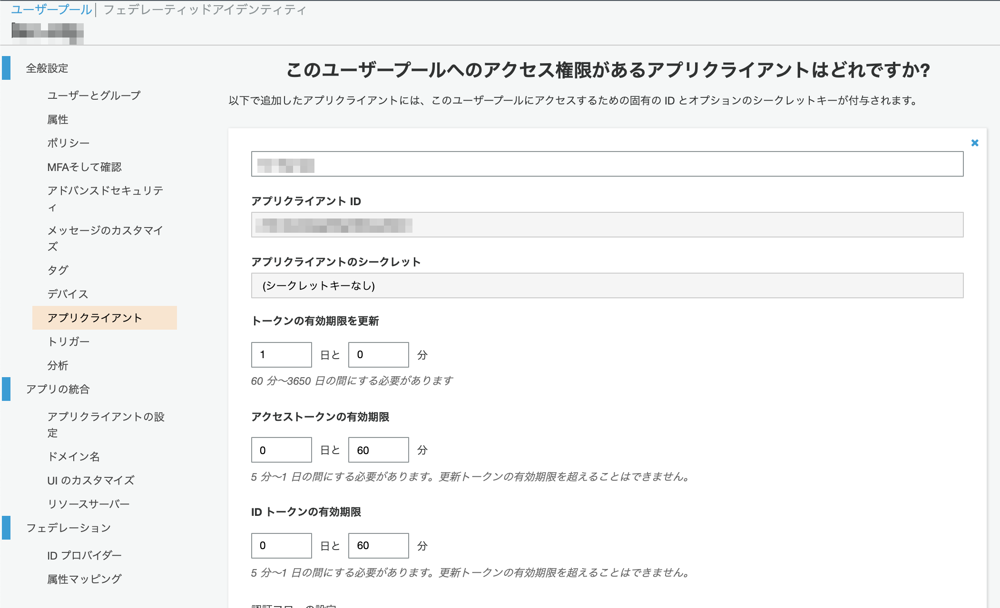

# Amazon Cognitoのセキュリティ設定

## セッションタイムアウトの変更

* ログイン状態のセッションタイムアウトについては、AWS Cognito の「トークン有効期限を更新」の設定値で変更できます(デフォルト設定: 1日)
* 設定期間を超えるとweb画面上はログイン状態のままですが、各種設定ができなくなります。

## ログインの規定回数以上誤りによるアカウントロック

* Amazon Cognitoの機能により一定回数ログインに失敗すると自動的にロックアウトされます。
	* [ユーザープール認証フロー](https://docs.aws.amazon.com/ja_jp/cognito/latest/developerguide/amazon-cognito-user-pools-authentication-flow.html)をご確認ください。