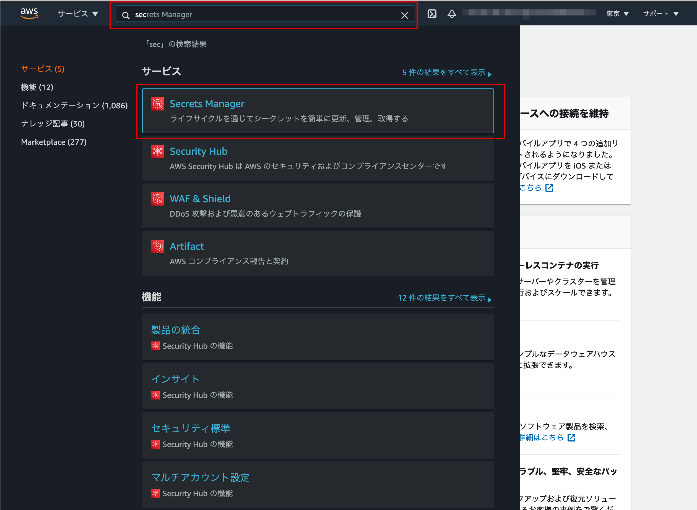
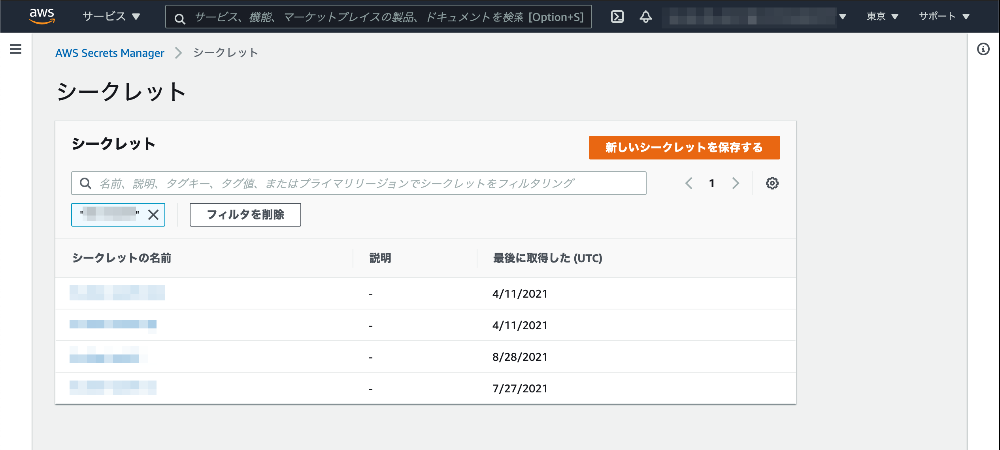
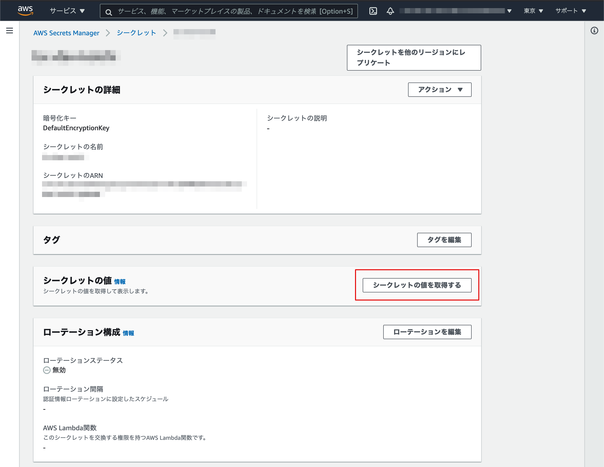
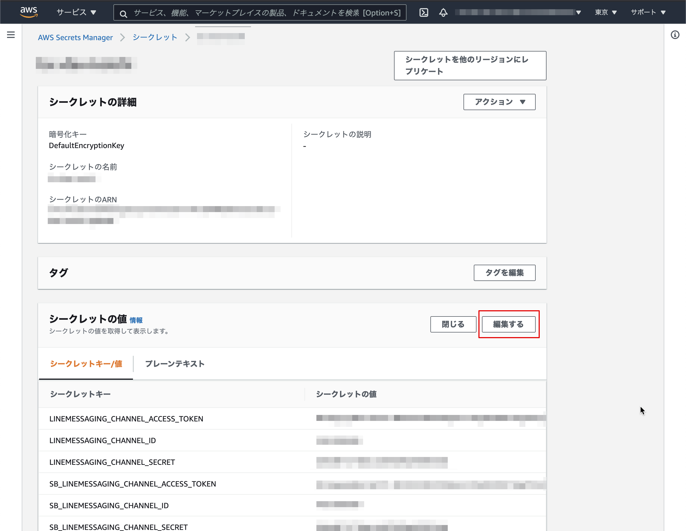
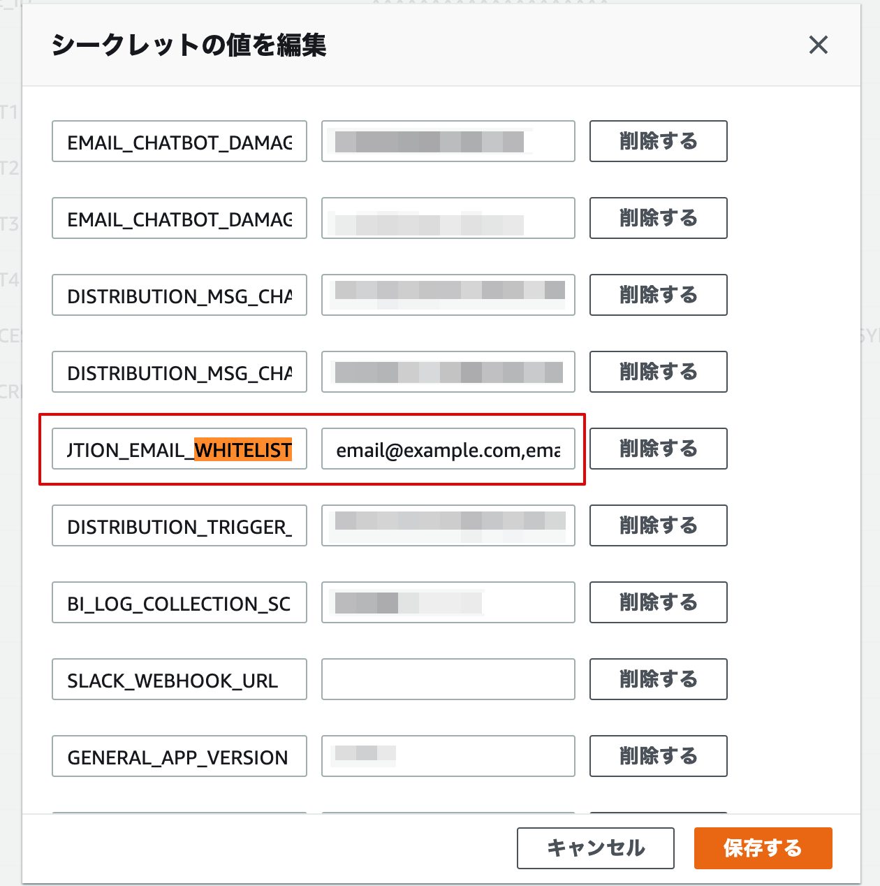
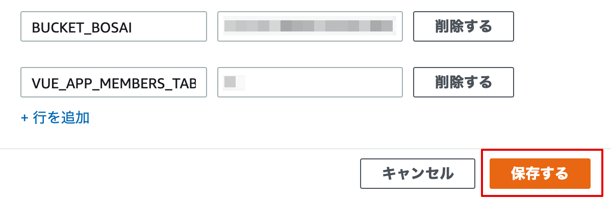

# セグメント配信の外部配信設定で送信元メールアドレスを制限する
AWS Secrets Managerの設定を変えることにより、セグメント配信の外部配信設定で送信元メールアドレスを制限することができます。

## 目次
- [1. AWSでの設定](#1-awsでの設定)
  - [1-1. AWSのマネジメントコンソールからSecrets Managerを開く](#1-1-awsのマネジメントコンソールからsecrets-managerを開く)
  - [1-2. 対象のシークレットを選択](#1-2-対象のシークレットを選択)
  - [1-3. シークレットの値を取得するをクリック](#1-3-シークレットの値を取得するをクリック)
  - [1-4. 編集するをクリック](#1-4-編集するをクリック)
  - [1-5. DISTRIBUTION_EMAIL_WHITELISTの値に、whitelistに追加したいメールアドレスを「,」区切りで入力](#1-5-distribution_email_whitelistの値にwhitelistに追加したいメールアドレスを区切りで入力)
  - [1-6. 保存するをクリック](#1-6-保存するをクリック)
- [2. 設定の反映](#2-設定の反映)
  - [2-1. lsc.shから再デプロイする](#2-1-lscshから再デプロイする)

## 1. AWSでの設定
### 1-1. AWSのマネジメントコンソールからSecrets Managerを開く



### 1-2. 対象のシークレットを選択


### 1-3. シークレットの値を取得するをクリック



### 1-4. 編集するをクリック



### 1-5. DISTRIBUTION_EMAIL_WHITELISTの値に、whitelistに追加したいメールアドレスを「,」区切りで入力



### 1-6. 保存するをクリック



## 2. 設定の反映
### 2-1. lsc.shから再デプロイする

```bash
$ ./lsc.sh distribution fresh
```
