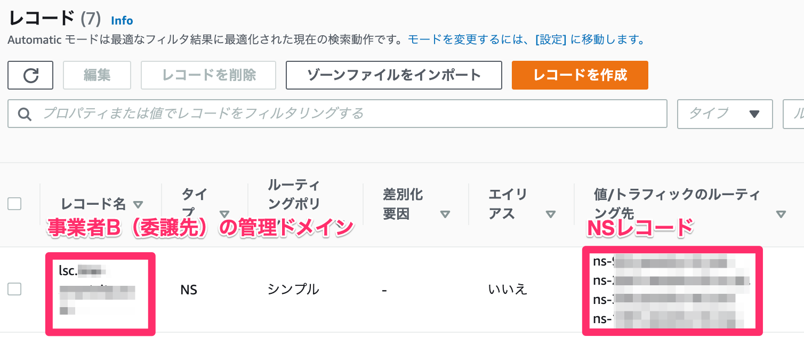
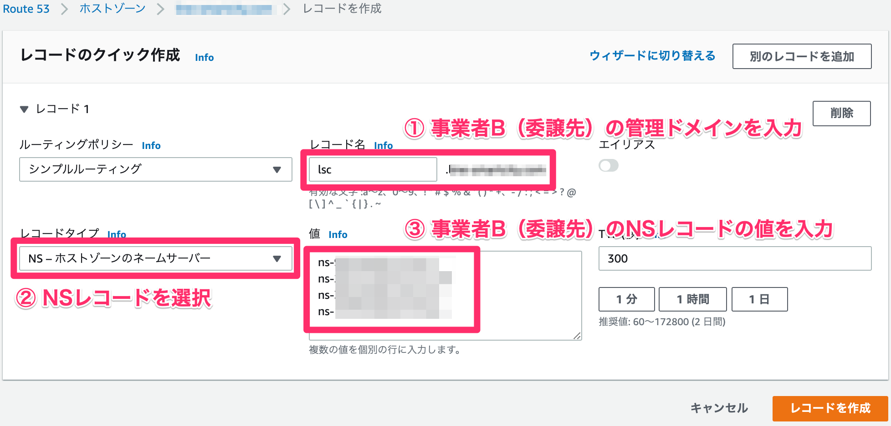

# Amazon Route53のドメイン設定

## サブドメインの権限移譲
### 事業者A（委譲元） から 事業者B（委譲先） にサブドメインを権限移譲する場合
* 例
	* 事業者A（委譲元）の管理ドメイン： `example.com`
	* 事業者B（委譲先）の管理ドメイン： `環境名.example.com`
	    * デプロイすると、管理画面のURLは `https://admin.環境名.example.com` になります。
* 手順
	1. 事業者B（委譲先）のAmazon Route53（以下、「Route53」）でサブドメインのHosted Zoneを作成
		* ドメイン名：　`環境名.example.com`
		* タイプ：　パブリックホストゾーン
	2. 作成されたHosted ZoneのNSレコードをメモする
		
	3. 事業者B（委譲先）のNSレコードを事業者A（委譲元）のRoute53にてNSレコードに設定
		
* 参考
    * 親ドメインを移行しないで Amazon Route 53 を サブドメインの DNS サービスとして使用する
        * https://docs.aws.amazon.com/ja_jp/Route53/latest/DeveloperGuide/creating-migrating.html

## Route53 をDNSとして使用する
* Route53 を使用中のドメインの DNS サービスにする
    * https://docs.aws.amazon.com/ja_jp/Route53/latest/DeveloperGuide/migrate-dns-domain-in-use.html
