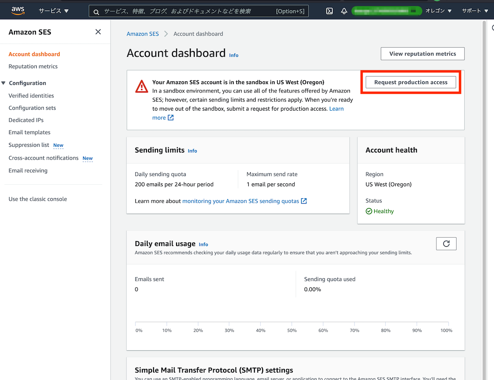
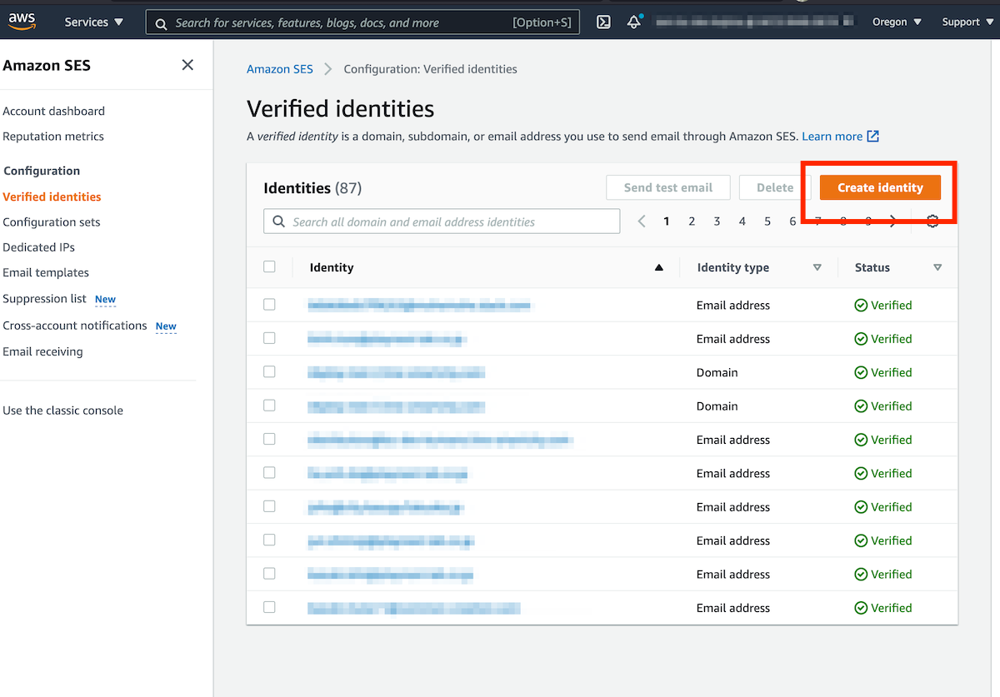
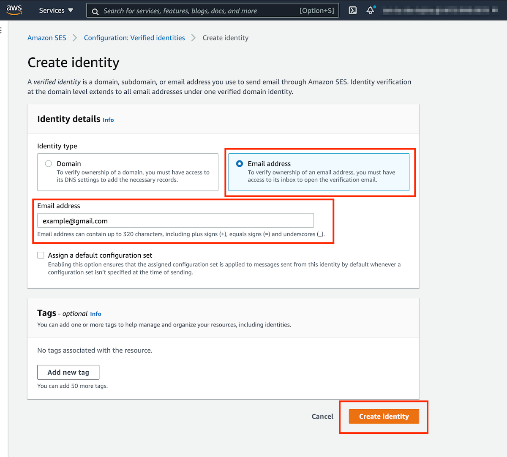

# SESの受信メールアドレス設定

## 目次
- [1. 損傷報告を受け取るメールアドレスの設定](#1-損傷報告を受け取るメールアドレスの設定)
- [2. 外部配信設定でメール連携をする場合](#2-外部配信設定でメール連携をする場合)
- [3. セキュリティ設定](#3-セキュリティ設定)
  - [3-1. 外部配信設定でメール連携をする場合](#3-1-外部配信設定でメール連携をする場合)

## 1. 損傷報告を受け取るメールアドレスの設定

環境構築のコマンド実施後にAmazon SES （以下、「SES」）の設定を実施してください。カスタムドメインの有無によって設定内容が異なります。

### 1-1. カスタムドメインを有効にしている場合

バージョン1.15.0よりSESメールアドレス設定は自動化されたため認証作業は不要ですが、
外部のメールアドレスに送信できるようにするためにSESアカウントをサンドボックス外に移動する必要があります。

はじめに[SESアカウント](https://us-west-2.console.aws.amazon.com/sesv2/home?region=us-west-2#/account)にアクセスします。必ずリージョンが「オレゴン」になっていることを確認してください。

「Request production access」をクリックします。

1. Mail type：「Transactional」を選択
2. Website URL：LINEの友だちページURLを入力 ※リッチメニューやシナリオが設定済みであること
3. Use case description：「LINEと連携したWEBサービスでSESによるメールの送信を実装するため」と入力
4. 利用規約に同意するチェックボックスにチェック
5. リクエストを送信

リクエスト送信後、24時間以内にサポートからのフィードバックを受け取ります。

### 1-2. カスタムドメインを無効にしている場合

[SES コンソール](https://us-west-2.console.aws.amazon.com/sesv2/home?region=us-west-2#/verified-identities)で設定をします。必ずリージョンが「オレゴン」になっていることを確認してください。

「Create identity」をクリックします。

1. Identity type：「Email address」を選択
2. Email address：お持ちのメールアドレスを入力
    * ここで入力するメールアドレスは、[損傷報告先メールアドレスの設定](../README.md#4-損傷報告先メールアドレスの設定)で設定するメールアドレスである必要があります
3. 「Create identity」をクリック
4. メールアドレスに届いた認証メール内のリンクをクリックして認証完了です。

## 2. 外部配信設定でメール連携をする場合

カスタムドメインを有効化している場合、バージョン1.15.0よりSESメールアドレス設定は自動化されたため作業は不要です。

カスタムドメインを無効にしている場合、本機能は利用することができません。

## 3. セキュリティ設定

### 3-1. 外部配信設定でメール連携をする場合

「[セグメント配信の外部配信設定で送信元メールアドレスを制限する](./AWS_EMAIL_WHITELIST_SETTINGS.md)」をご参照ください。

