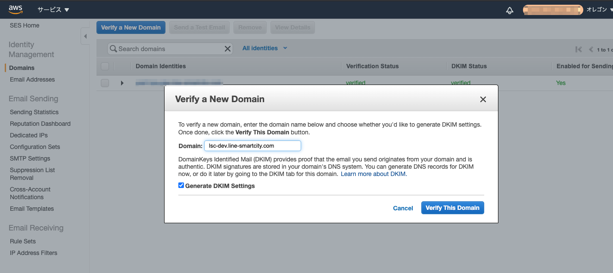

# AWS設定

## 1. Route53のホストゾーン作成
[Route53](https://aws.amazon.com/jp/route53/)でホストゾーンを作成します。  
ドメイン名は`環境名.ルートドメイン (example.com など)` を入力します。

※作成する環境とは別のAWSアカウントでドメインを管理している場合や、Route53以外のDNSサービスで利用しているドメインを設定する場合は、「[Amazon Route53のドメイン設定](./AWS_ROUTE53_DOMAIN_SETTINGS.md)」を参考に設定を行ってください。

## 2. 管理画面とLIFFにおけるカスタムドメイン設定

管理画面URLと帳票URL（LIFF）でカスタムドメインを設定する場合は、以下の手順を行ってください。

### 設定手順
1. シークレット修正

`deploy/secrets_manager/環境名.json` を開き、下記のキーを編集します。

| No | LINE OA | シークレットキー | 内容 | 備考 |
|:---|:---|:---|:---|:---|
| 1 | 共通 | DNS_DOMAIN | ルートドメイン (example.com など) | 以下のURLで使用されます。 <br><br> 管理画面URL： <br> https://admin.環境名.ルートドメイン  <br>  帳票URL（LIFF）： <br> https://liff.環境名.ルートドメイン |
| 2 | 共通 | DNS_HOSTED_ZONE_ID | 「1.」で作成したRoute53 ホストゾーンのID | |

2. シークレット反映
jsonを編集後、下記を実行してシークレット更新します

```bash
$ ./lsc.sh secrets update
```

3. カスタムドメイン設定を有効にする

```bash
$ ./lsc.sh setupDomain true
```

これでカスタムドメイン設定は完了です。

## 3. SESのドメイン追加

us-west-2リージョンに、メール受信で利用するドメインを追加します。

[SES コンソール](https://us-west-2.console.aws.amazon.com/ses/home?region=us-west-2#)にアクセスして設定を行ってください。

### ドメインの追加

* (1)：「Verify a New Domain」をクリック
* (2)：「Domain」の入力欄に`環境名.ルートドメイン (example.com など)`を入力
* (3)：「Generate DKIM Settings」にチェックを入れる
* 「Verify This Domain」をクリックすると、Route53にCNAMEレコード・TXTレコード・MXレコードが追加される旨のメッセージが表示されます。**MXレコードの利用にチェックを入れて**、Route53にレコードを追加してください。
* 最後に、Route53にCNAMEレコード・TXTレコード・MXレコードが追加されていることを確認してください。



