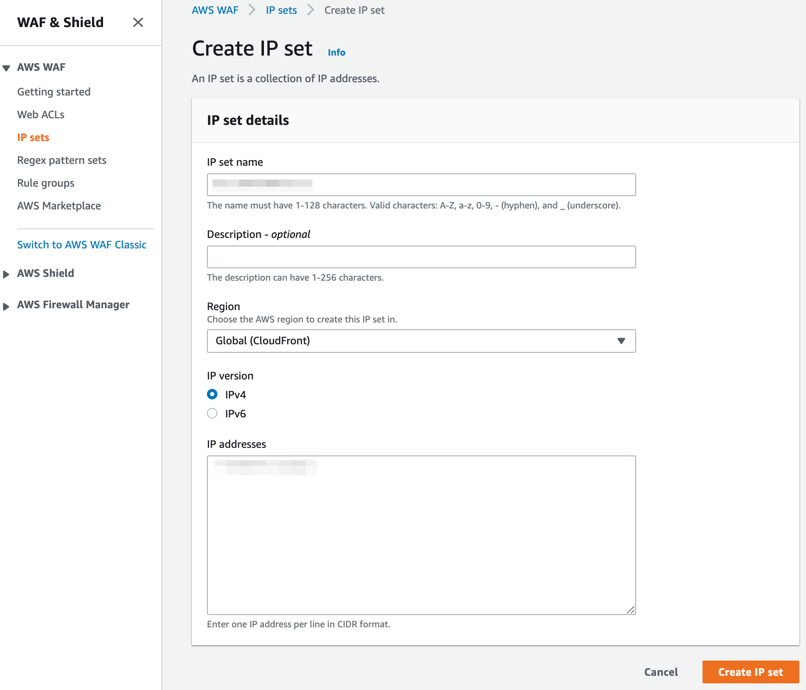
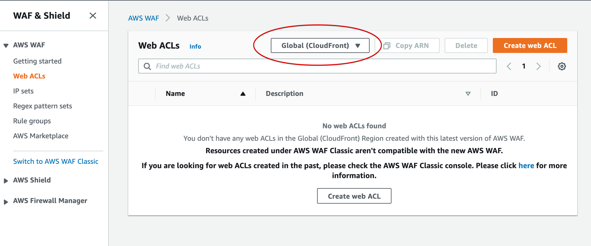
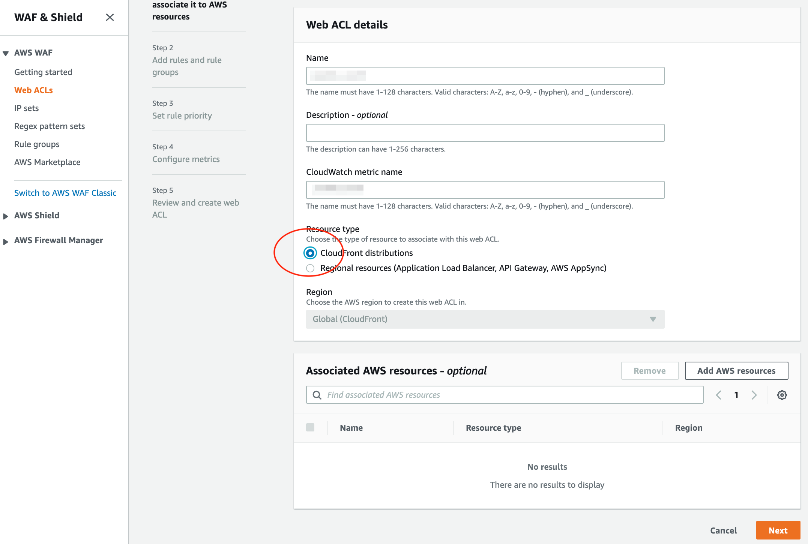
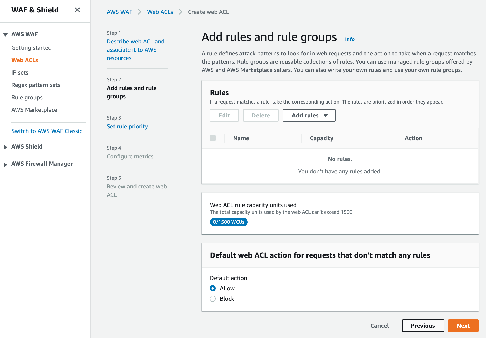
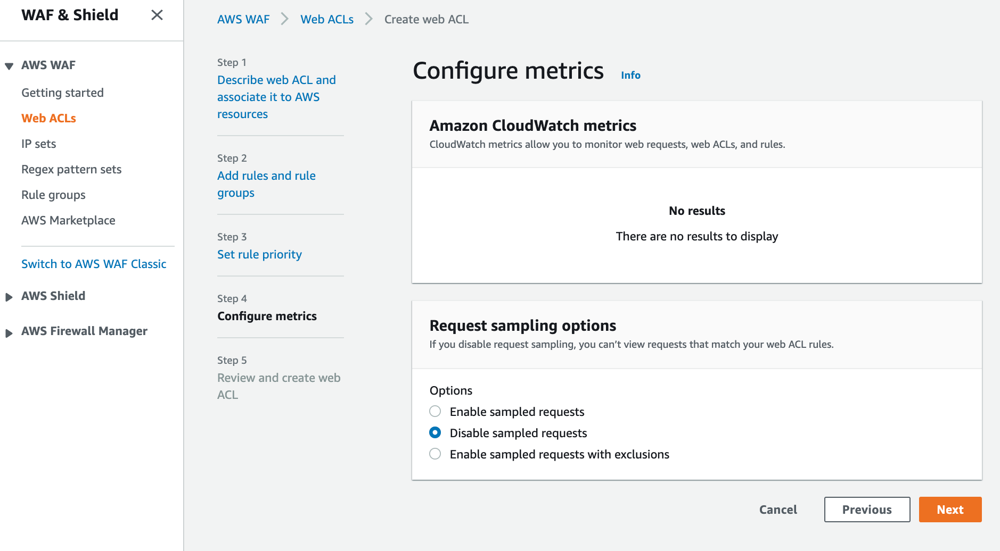
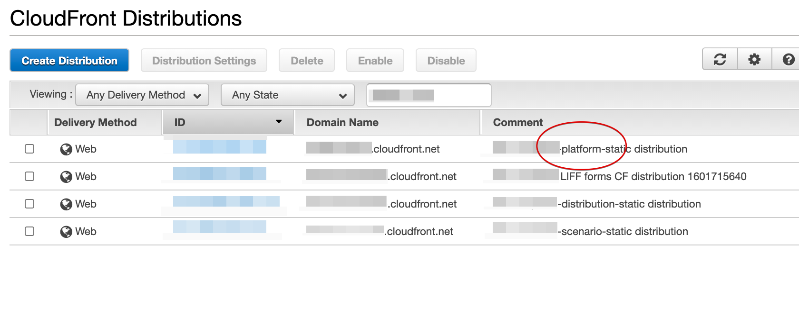
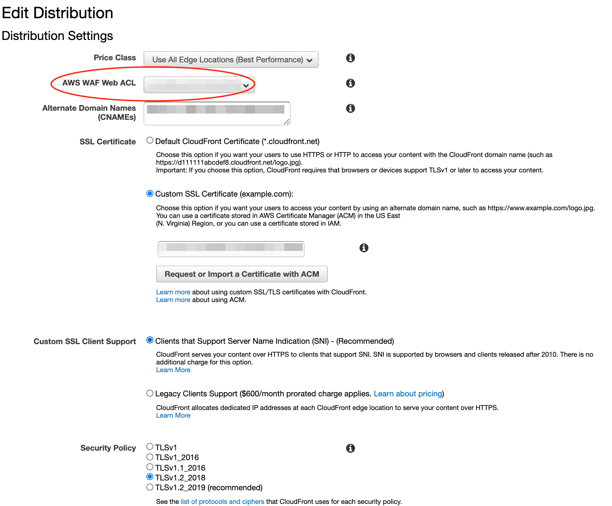

# IPアドレスアクセス制限
AWS WAFのIP setsを適用することによりIPアドレスのアクセス制限をすることができます。

- [AWS WAFの設定](#aws-wafの設定)
    - [IP Setの作成](#ip-setの作成)
    - [Web ACL の設定](#web-acl-の設定)
        - [Web ACL details の設定](#web-acl-details-の設定)
        - [Add my own rules and rule groups の設定](#add-my-own-rules-and-rule-groups-の設定)
        - [IP Set の設定](#ip-set-の設定)
        - [Add rules and rule groups の設定](#add-rules-and-rule-groups-の設定)
        - [Configure metrics](#configure-metrics)
- [CloudFrontの設定](#cloudfrontの設定)
    - [対象のCloudFrontの選択](#対象のcloudfrontの選択)
    - [Distributionの編集](#distributionの編集)

## AWS WAFの設定
### IP Setの作成
アクセス対象とするIPアドレスをIP addressに入力します。

### Web ACL の設定
Web ACLsをクリックします。

#### Web ACL details の設定
CloudFront Distributionを選択します。

#### Add my own rules and rule groups の設定
プルダウンメニューからAdd my own rules and rule groupsを選択します。

#### IP Set の設定
Rule typeからIP setを選択します。

#### Add rules and rule groups の設定
Default web ACL actionとしてBlockを選択します。

#### Configure metrics
必要に応じてCloudWatch metricsを設定します。

## CloudFrontの設定
### 対象のCloudFrontの選択
comment欄に `[環境名]-platform-static distribution`と記されているCloudFrontを選択します。

### Distributionの編集
AWS WAF Web ACLで作成したACLを選択します。

