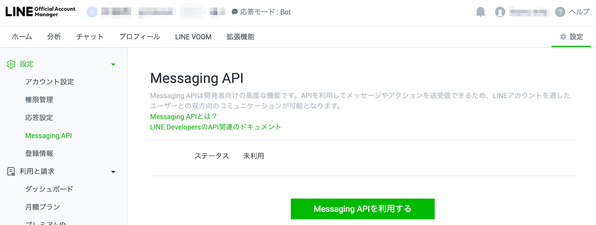
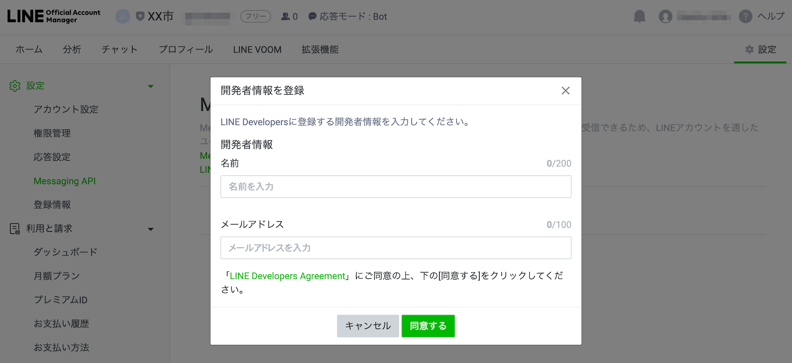

# LINE Developers チャネル設定(Messaging API)

[LINE Official Account Manager](https://manager.line.biz/)、[LINE Developers](https://developers.line.biz/ja/)にて、チャネル設定を行います。  
チャネル作成の際、[LINEビジネスID](https://faq.linebiz.com/help/s/article/000001155?language=ja)を用いた作成を推奨しています。

## 目次
  - [1. スタック作成前の設定](#1-スタック作成前の設定)
    - [1-1. LINE Official Account ManagerでLINE公式アカウントを作成](#1-1-line-official-account-managerでline公式アカウントを作成)
    - [1-2. LINE公式アカウントとMessaging APIを紐づける](#1-2-line公式アカウントとmessaging-apiを紐づける)
    - [1-3. Messaging API アクセストークンの発行](#1-3-messaging-api-アクセストークンの発行)
    - [1-4. Secrets Manager設定項目を控える](#1-4-secrets-manager設定項目を控える)
    - [1-5. LINE Official Account Managerの応答設定](#1-5-line-official-account-managerの応答設定)
  - [2. スタック作成後の設定](#2-スタック作成後の設定)
    - [2-1. Messaging API チャネルの設定変更](#2-1-messaging-api-チャネルの設定変更)

## 1. スタック作成前の設定
先ずは1-1.〜1-5.の手順を行ってください。
### 1-1. LINE Official Account ManagerでLINE公式アカウントを作成
[LINE Business ID](https://manager.line.biz/)の「ビジネスアカウントでログイン」よりログインします。  
まだビジネスアカウントをお持ちでない場合、「アカウントを作成」よりご登録ください。

* LINE公式アカウントを作成
    * アカウント タブをクリック
    * 左サイドバー「作成」をクリック
    * 以下項目を入力

    | 項目 | 説明 | 入力内容 | 例 |
    |---|---|---|---|
    | アカウント名 | LINEの友だちリストやトーク画面に表示される名称 | 必須 | XX市 |
    | メールアドレス | メールアドレス | 必須 | 自分のメールアドレス |
    | 会社・事業者の所在国・地域 | ここで設定した国・地域は、ユーザーが閲覧できるページ（アカウントのプロフィールなど）に表示されます | 必須 | 日本 |
    | 会社/事業者名 | 作成するLINE公式アカウントの会社/事業者名 | 任意 |  |
    | 大業種 | 作成するLINE公式アカウントの大業種 | 必須 | 公共機関・施設 |
    | 小業種 | 作成するLINE公式アカウントの小業種 | 必須 | 市町村機関 |

* 「確認」をクリック
* 確認内容が表示されるので、「完了」をクリック

### 1-2. LINE公式アカウントとMessaging APIを紐づける

[LINE Official Account Manager](https://manager.line.biz/)の対象アカウントのホーム画面へアクセスします。

右上にある「設定」をクリックします。

左サイドバー「Messaging API」をクリックします。

* Messaging APIを利用
    * 「Messaging APIを利用する」をクリック
*  開発者として登録する（初回ログイン時のみ）
    * 以下項目を入力

    | 項目 | 説明 | 入力内容 | 例 |
    |---|---|---|---|
    | 名前 | 名前 | 開発者の名前 | LINE Fukuoka株式会社 |
    | メールアドレス | メールアドレス | 自分のメールアドレス |  |

    * 「LINE Developers Agreement」に同意し、「同意する」ボタンをクリック
    * 確認ダイアログが表示されるので、「OK」をクリック

* プロバイダーを選択
    * プロバイダーを選択します
    * 新規作成の場合、以下項目を入力

    | 項目 | 説明 | 入力内容 | 例 |
    |---|---|---|---|
    | プロバイダー名 | 管理するチャネルが分かる名前 | 任意 | LINE Fukuoka株式会社 |

    * 「LINE公式アカウントAPI利用規約」に同意し、「同意する」ボタンをクリック
    * プライバシーポリシー、利用規約URLは任意で入力して、「OK」ボタンをクリック
    * 確認画面が表示されるので、「OK」ボタンをクリック

### 1-3. Messaging API アクセストークンの発行
[LINE Developers](https://developers.line.biz/ja/)にログインします  
※ 「ビジネスアカウントでログイン」を選択

* 作成したプロバイダーを選択
* 作成した Messaging API チャネルを選択
* アクセストークンの発行
    * Messaging API タブをクリック
    * チャネルアクセストークンにある「発行」ボタンより、チャネルアクセストークンを発行

### 1-4. Secrets Manager設定項目を控える

* Secrets Managerの設定に必要な項目を控えておきます（後ほど利用するため）
    * チャネルID
        * 1-2.で作成したMessaging APIのチャネル基本設定画面にある「チャネルID」
    * チャネルシークレット
        * 1-2.で作成したMessaging APIのチャネル基本設定画面にある「チャネルシークレット」
    * Messaging API トークン
        * 

### 1-5. LINE Official Account Managerの応答設定

[LINE Official Account Manager](https://manager.line.biz/)にアクセスし、対象アカウントのホーム画面へアクセスします。

右上にある「設定」をクリックします。

左サイドバー「応答設定」をクリックし、下記設定を行います。

* 「応答メッセージ」を**オフ**に設定
* 「Webhook」を**オン**に設定

## 2. スタック作成後の設定
下記は、[初期構築](../README.md#2-初期構築)の後に行ってください。

### 2-1. Messaging API チャネルの設定変更
* Webhook URLの設定
  * Messaging API タブをクリック
  * 「Webhook設定」でWebhook URLを追加
      * 本番環境の場合、CloudFormationのスタック名「 `環境名-scenario-dynamic` 出力タブにあるChatBotApi」+ `callback` がWebhook URLになります
          * 例：`https://abcdefghij.execute-api.ap-northeast-1.amazonaws.com/Prod/chatbot/callback`
      * サンドボックス環境の場合、本番環境のWebhook URLを `chatbot_sandbox`に置き換えたURLとなります
          * 例：`https://abcdefghij.execute-api.ap-northeast-1.amazonaws.com/Prod/chatbot_sandbox/callback`
  * 「Webhookの利用」のスイッチをクリックして有効にします
  * 検証ボタンを押して、200 OKのレスポンスが返ってくることを確認してください
