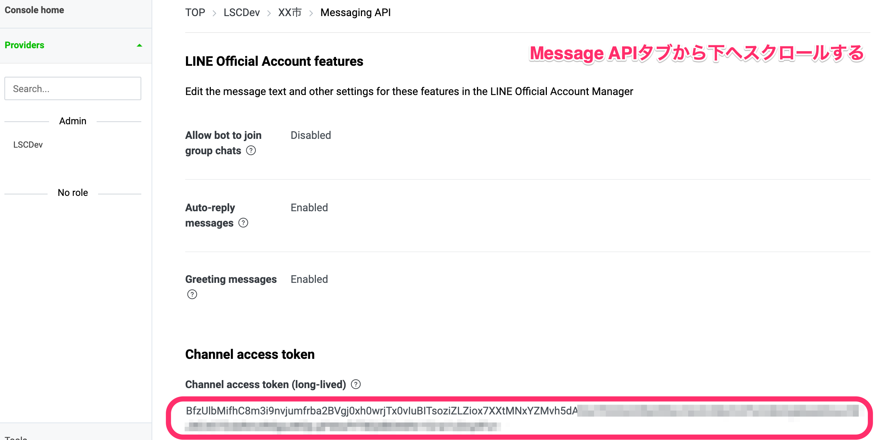
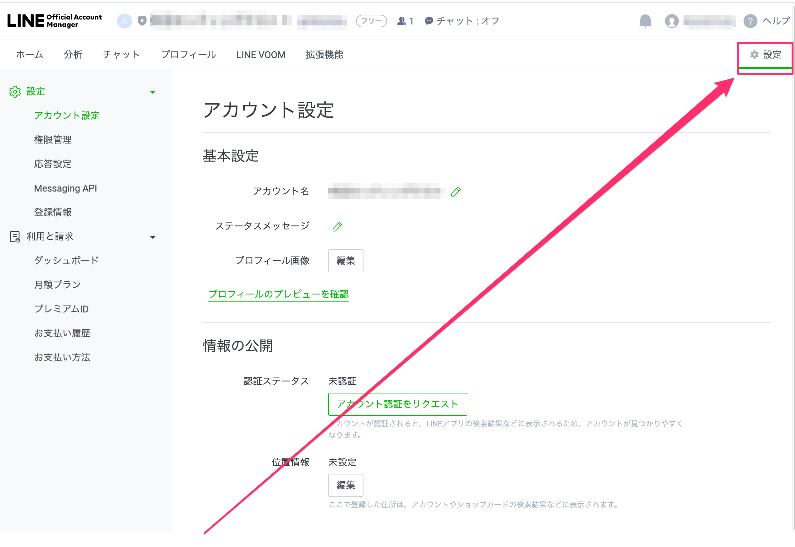
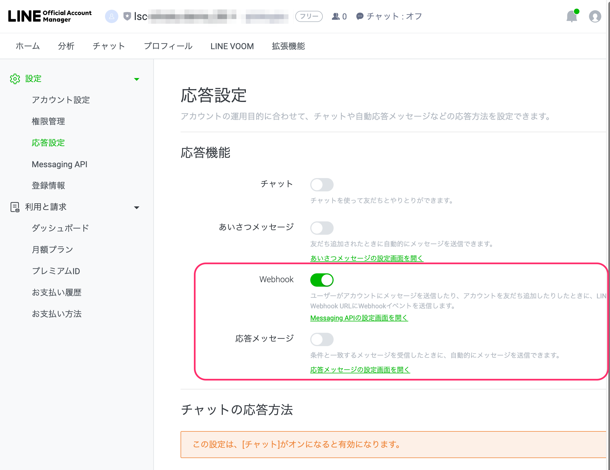

# LINE Developers チャネル設定(Messaging API)

## 目次
  - [1. スタック作成前の設定](#1-スタック作成前の設定)
    - [1-1. LINE DevelopersでProviderを作成](#1-1-line-developersでproviderを作成)
    - [1-2. Messaging API チャネルの作成](#1-2-messaging-api-チャネルの作成)
    - [1-3. Secrets Manager設定項目を控える](#1-3-secrets-manager設定項目を控える)
    - [1-4. LINE Official Account Managerの応答設定](#1-4-line-official-account-managerの応答設定)
  - [2. スタック作成後の設定](#2-スタック作成後の設定)
    - [2-1. Messaging API チャネルの設定変更](#2-1-messaging-api-チャネルの設定変更)

## 1. スタック作成前の設定
先ずは1-1.〜1-4.の手順を行ってください。

### 1-1. LINE DevelopersでProviderを作成
[LINE Developers](https://developers.line.biz/ja/)にログインします

* プロバイダーの作成
    * 作成ボタンから、新規プロバイダーの作成を行います
    * 以下項目を入力

    | 項目 | 説明 | 入力内容 | 例 |
    |---|---|---|---|
    | プロバイダー名 | 管理するチャネルが分かる名前 | 任意 | LINE Fukuoka株式会社 |

### 1-2. Messaging API チャネルの作成
* チャネルの作成
    * トップから対象のプロバイダーを選択する
    * 新規チャネル作成より、Messaging APIを選択
    * 以下項目を入力

    | 項目 | 説明 | 入力内容 | 例 |
    |---|---|---|---|
    | チャネル名 | 作成するチャネルの名前 | 任意。チャネル名には、「LINE」またはそれに類する文字列は含められません。 | XX市 |
    | チャネル説明 | 作成するチャネルの説明 | 任意 | 防災・ごみ・子育て等の情報をお届けします |
    | 大業種 | 作成するチャネルの大業種 | 任意 | 公共機関・施設 |
    | 小業種 | 作成するチャネルの小業種 | 任意 | 市町村機関 |
    | メールアドレス | メールアドレス | 自分のメールアドレス |  |
    
    * 各利用規約に同意し、作成ボタンをクリック
    * 補足
        * チャネルアイコン、プライバシーポリシーURL、サービス利用規約URLは任意で入力する

* アクセストークンの発行
    * Messaging API タブをクリック
    * チャネルアクセストークンにある「発行」ボタンより、チャネルアクセストークンを発行

### 1-3. Secrets Manager設定項目を控える

* Secrets Managerの設定に必要な項目を控えておきます（後ほど利用するため）
    * チャネルID
        * 2.で作成したMessaging APIのチャネル基本設定画面にある「チャネルID」
    * チャネルシークレット
        * 2.で作成したMessaging APIのチャネル基本設定画面にある「チャネルシークレット」
    * Messaging API トークン
        * 

### 1-4. LINE Official Account Managerの応答設定

[LINE Official Account Manager](https://manager.line.biz/)にアクセスし、対象アカウントのホーム画面へアクセスします。

右上にある「設定」をクリックします。

左サイドバー「応答設定」をクリックし、下記設定を行います。

* 「応答メッセージ」を**オフ**に設定
* 「Webhook」を**オン**に設定

## 2. スタック作成後の設定
下記は、[初期構築](../README.md#2-初期構築)の後に行ってください。

### 2-1. Messaging API チャネルの設定変更
* Webhook URLの設定
  * Messaging API タブをクリック
  * 「Webhook設定」でWebhook URLを追加
      * 本番環境の場合、CloudFormationのスタック名「 `環境名-scenario-dynamic` 出力タブにあるChatBotApi」+ `callback` がWebhook URLになります
          * 例：`https://abcdefghij.execute-api.ap-northeast-1.amazonaws.com/Prod/chatbot/callback`
      * サンドボックス環境の場合、本番環境のWebhook URLを `chatbot_sandbox`に置き換えたURLとなります
          * 例：`https://abcdefghij.execute-api.ap-northeast-1.amazonaws.com/Prod/chatbot_sandbox/callback`
  * 「Webhookの利用」のスイッチをクリックして有効にします
  * 検証ボタンを押して、200 OKのレスポンスが返ってくることを確認してください
