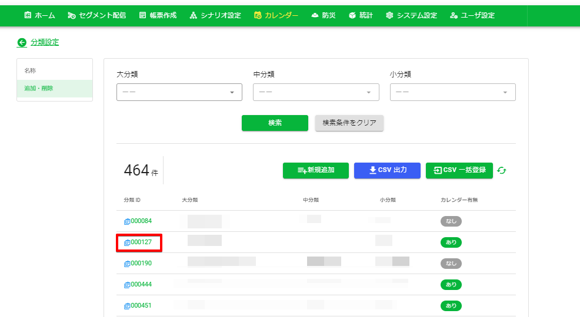
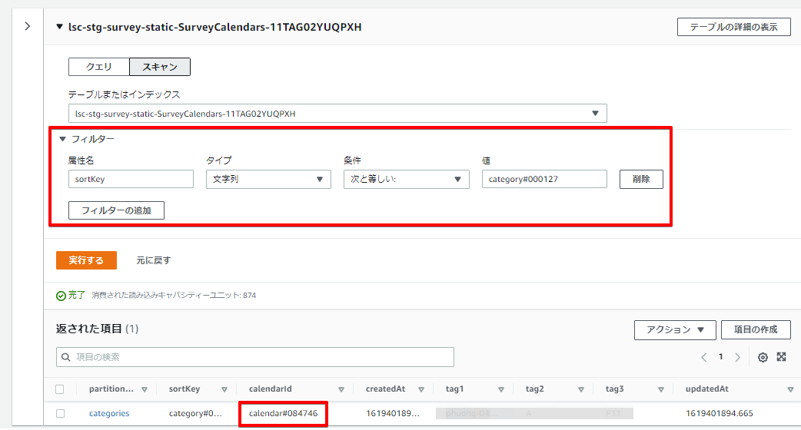
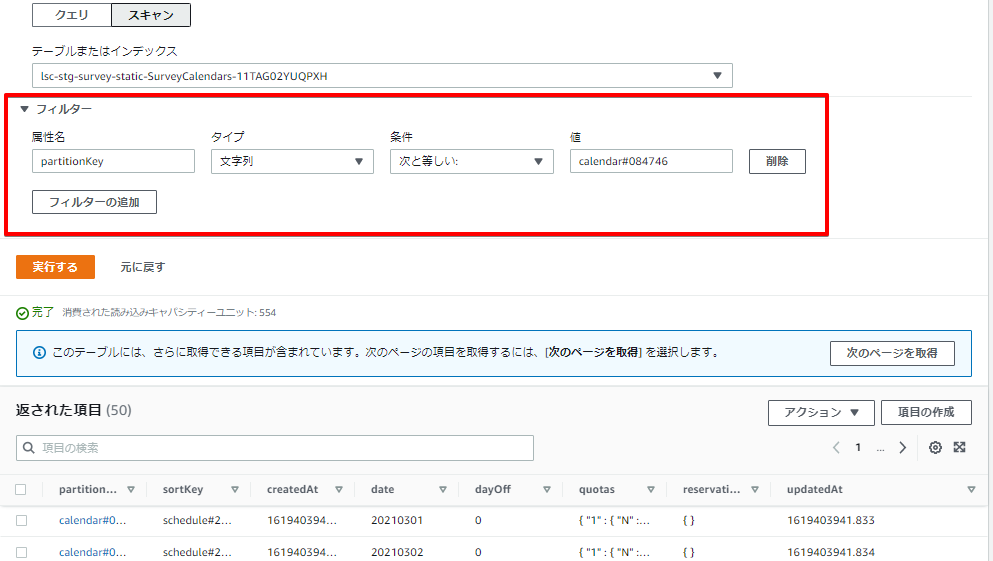
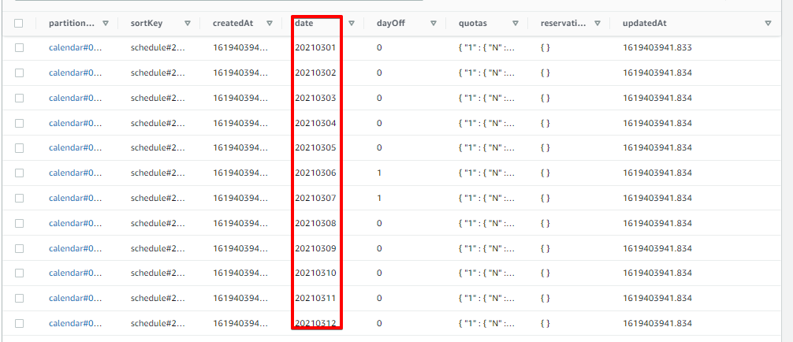
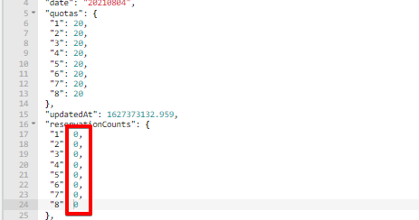

# カレンダー機能の分類ID削除について
​
既に予約が入っているカレンダーの分類IDは、管理画面上から削除することができません。
以下の手順で削除してください。
​
## カレンダーの分類ID削除手順

1. 対象となる分類IDの予約を管理画面の「ホーム」より全てキャンセルする

2. 管理画面の「カレンダー」⇒「カレンダー設定」より、削除対象カレンダーを選択して「予約数/予約枠数」が全て「0/XX」となった状態にする（分子を0にする）
​
3. 管理画面の「カレンダー」⇒「カレンダー設定」⇒「分類設定」⇒「追加・削除」より、対象の分類IDを選択
​
4. 「分類編集」画面から対象の分類を削除する 
​  
​  
また、キャンセルせずに削除してしまった場合等、対象レコードがホーム画面から存在しない場合でも、カレンダーの予約数が1以上として残る場合があります。
このように予約数だけが残ってしまった場合、以下の手順で直接DynamoDBの値を更新して予約数を0にしてください。
​
## 予約数だけが残ってしまった場合

1. 管理画面の「カレンダー」⇒「カレンダー設定」⇒「分類設定」⇒「追加・削除」より、削除対象の分類IDを特定する

    

2. AWSにログインし、DynamoDB > SurveyCalendarsテーブルにて、以下検索条件でスキャンする

    

3. 対象のカレンダーIDを特定する

    

4. 予約数を変更したい（分子を0にしたい）日付を「date」から特定する
  
    

5. 対象のレコードのresevationCounts(予約数)の数を0に修正する
  
    

6. 管理画面の「カレンダー」⇒「カレンダー設定」⇒「分類設定」⇒「追加・削除」より、対象の分類IDを選択
  
7. 「分類編集」画面から対象の分類を削除する 
   * 削除前にSurveyResultsに対象の分類IDのレコードが無いことを確認してください
   * SurveyResultsに対象の分類IDのレコードが残っていた場合、残っているレコードを選択するとエラーとなります
