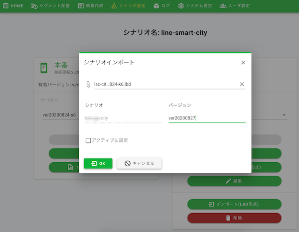

# 管理画面 | シナリオ設定

## 目次
  - [1. シナリオ設定](#1-シナリオ設定)
    - [1-1. シナリオのインポート](#1-1-シナリオのインポート)
    - [1-2. バージョン切替 （サンドボックス）](#1-2-バージョン切替-サンドボックス)
    - [1-3. バージョン切替 （本番）](#1-3-バージョン切替-本番)
  - [2. リッチメニュー作成](#2-リッチメニュー作成)
  - [3. LINE公式アカウントの設定](#3-line公式アカウントの設定)
    - [3-1. LINE Official Account Managerにログイン](#3-1-line-official-account-managerにログイン)
    - [3-2. 友だち追加](#3-2-友だち追加)
    - [3-3. プロフィール設定および公開](#3-3-プロフィール設定および公開)
    - [3-4. 設定 アカウントやプランの設定について](#3-4-設定-アカウントやプランの設定について)

## 1. シナリオ設定

1-1.〜1-3.の手順にて、LINE公式アカウントの利用準備を行います。

### 1-1. シナリオのインポート

__[2022/01/18をもってLINE Bot Designerの開発は終了しています。](https://developers.line.biz/ja/news/2022/01/18/development-of-line-bot-designer-has-been-finished/)LINE Bot Designerでは、今後Messaging APIに追加される新機能が利用できないため、新規シナリオの作成についてはシナリオ設定のマップ表示機能の活用を推奨します。__

* [LINE Bot Designer](https://developers.line.biz/ja/services/bot-designer/) のシナリオ(.lbdファイル)を以下よりダウンロード
    * https://share.lsc.line-smartcity.com/lbd/govtech-demo.lbd
* 管理画面にログインする
* メニューより「シナリオ設定」を選択
* サンドボックスの「インポート（LBD形式）」ボタンをクリック
* 以下項目を入力

| 項目 | 説明 | 入力内容 |
|---|---|---|
| LBDファイル | シナリオ（.lbdファイル）  | ローカルより選択されたシナリオ（.lbdファイル） |
| シナリオ | 適用されるシナリオ名 | LBDファイルをアップロードすると自動で反映されます |
| バージョン | 適用するバージョン | 任意 |
| アクティブに設定 | シナリオを即座に適用するかどうかのチェック | 任意 |

* 「OK」ボタンをクリックして、シナリオインポートを完了する

* 

### 1-2. バージョン切替 （サンドボックス）
* サンドボックスのバージョンを選択
* 有効バージョンと異なるバージョンを選択
* 「有効にする」ボタンをクリックして、選択したバージョンを有効にする

### 1-3. バージョン切替 （本番）
* 本番のバージョンを選択
* 有効バージョンと異なるバージョンを選択
* 「有効にする」ボタンをクリックして、選択したバージョンを有効にする

## 2. リッチメニュー作成

リッチメニューの作成手順については[こちら](https://docs.line-smartcity.org/85356e85da49445c9e521f2007fe06cd)をご確認ください。

## 3. LINE公式アカウントの設定

### 3-1. LINE Official Account Managerにログイン
* [LINE Official Account Manager](https://manager.line.biz/)にログインします
* アカウントリストより、[LINE Developers](https://developers.line.biz/ja/) で作成したMessaging API Channelの「アカウント」を選択

### 3-2. 友だち追加
* ホームメニューから「友だち追加」を選択
    * 詳細は「[友だち追加](https://www.linebiz.com/jp/manual/OfficialAccountManager/gain-friends/overview/)」を参照

### 3-3. プロフィール設定および公開
* プロフィールメニューを選択
    * 詳細は「[プロフィール](https://www.linebiz.com/jp/manual/OfficialAccountManager/account-page/settings/)」を参照

### 3-4. 設定 アカウントやプランの設定について
* 設定を選択
    * 詳細は「[設定 アカウントやプランの設定について](https://www.linebiz.com/jp/manual/OfficialAccountManager/settings/overview/)」を参照
    * プランについては「[料金プラン](https://www.linebiz.com/service/line-official-account/plan/)」を参照
