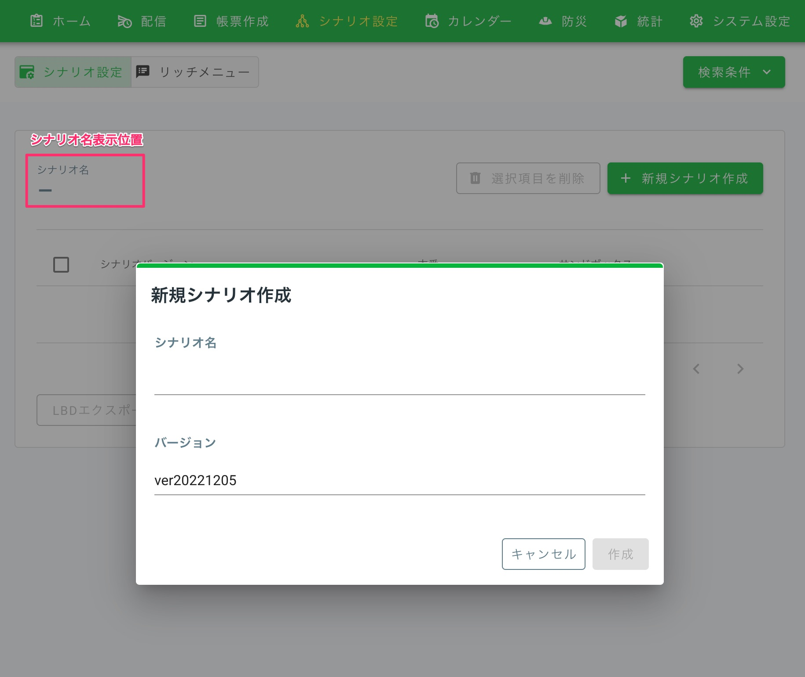

# 管理画面 | シナリオ設定

## 目次
  - [1. シナリオ設定](#1-シナリオ設定)
  - [2. リッチメニュー作成](#2-リッチメニュー作成)
  - [3. LINE公式アカウントの設定](#3-line公式アカウントの設定)
    - [3-1. LINE Official Account Managerにログイン](#3-1-line-official-account-managerにログイン)
    - [3-2. 友だち追加](#3-2-友だち追加)
    - [3-3. プロフィール設定および公開](#3-3-プロフィール設定および公開)
    - [3-4. 設定 アカウントやプランの設定について](#3-4-設定-アカウントやプランの設定について)

## 1. シナリオ設定

シナリオの作成手順については[LINE SMART CITY 操作マニュアル](https://liberating-circle-e6c.notion.site/LINE-SMART-CITY-d578ea0b46354288a14fa9cfc5a000dd)の「シナリオ設定」のページを参照ください。

なお、初回のシナリオ作成時のみ、`シナリオ名`の入力が求められます。シナリオ名はシナリオ一覧画面に表示される項目で後から変更ができないため、適切な名称を付与してください。

* 

## 2. リッチメニュー作成

リッチメニューの作成については[LINE SMART CITY 操作マニュアル](https://liberating-circle-e6c.notion.site/LINE-SMART-CITY-d578ea0b46354288a14fa9cfc5a000dd)の「リッチメニューの作成」のページを参照ください。

## 3. LINE公式アカウントの設定

### 3-1. LINE Official Account Managerにログイン
* [LINE Official Account Manager](https://manager.line.biz/)にログインします
* アカウントリストより、[LINE Developers](https://developers.line.biz/ja/) で作成したMessaging API Channelの「アカウント」を選択

### 3-2. 友だち追加
* ホームメニューから「友だち追加」を選択
    * 詳細は「[友だち追加](https://www.linebiz.com/jp/manual/OfficialAccountManager/gain-friends/overview/)」を参照

### 3-3. プロフィール設定および公開
* プロフィールメニューを選択
    * 詳細は「[プロフィール](https://www.linebiz.com/jp/manual/OfficialAccountManager/account-page/settings/)」を参照

### 3-4. 設定 アカウントやプランの設定について
* 設定を選択
    * 詳細は「[設定 アカウントやプランの設定について](https://www.linebiz.com/jp/manual/OfficialAccountManager/settings/overview/)」を参照
    * プランについては「[料金プラン](https://www.linebiz.com/service/line-official-account/plan/)」を参照
