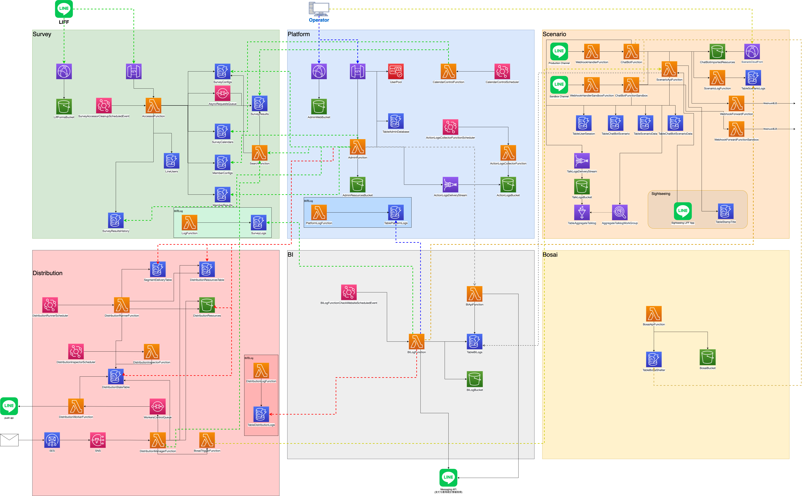

# 開発用コマンド一覧

## 目次
  - [1. 環境構築スクリプトについて](#1-環境構築スクリプトについて)
    - [オプションについて](#オプションについて)
    - [システム構成図](#システム構成図)
    - [モジュール一覧](#モジュール一覧)
    - [使用するAWSサービス](#使用するawsサービス)
  - [2. コマンド：メニュー操作](#2-コマンドメニュー操作)
    - [Cognitoユーザー](#cognitoユーザー)
  - [3. コマンド：即座に実行](#3-コマンド即座に実行)
    - [全環境のデプロイ](#全環境のデプロイ)
    - [全環境の削除](#全環境の削除)
    - [モジュール単位の更新](#モジュール単位の更新)
    - [モジュール単位の削除](#モジュール単位の削除)
  - [4. コマンド詳細](#4-コマンド詳細)
    - [S3 共通](#s3-共通)
    - [Secrets Manager](#secrets-manager)
    - [動的リソース (SAM)](#動的リソース-sam)
    - [静的リソース (CloudFormation)](#静的リソース-cloudformation)
    - [SES (SAM)](#ses-sam)
    - [管理画面フロントエンド (Vue.js)](#管理画面フロントエンド-vuejs)
    - [LIFF (Vue.js)](#liff-vuejs)
    - [カスタムドメインの設定](#カスタムドメインの設定)
    - [デバッグモードの指定](#デバッグモードの指定)
  - [5. TIPS](#5-TIPS)
    - [SAMのビルド時にコンテナを利用する](#samのビルド時にコンテナを利用する)
    - [静的リソースの削除オプション](#静的リソースの削除オプション)


## 1. 環境構築スクリプトについて
環境構築スクリプトは、環境の初期構築、ビルド・デプロイ、ユーザー設定、環境変数管理などの作業を簡単かつスムーズに行うためのスクリプトです。

### オプションについて
初回の実行時のみ、オプションの指定が必要です。

```bash
$ ./lsc.sh -e 環境名 -p lsc-dev -r ap-northeast-1
```

* `-e` : 環境名
* `-p` : プロファイル名
* `-r` : リージョン（指定しなくても良いですがその場合は自動的に`ap-northeast-1`となります）  

2回目以降は、キャッシュに保存されるのでオプションの指定は不要です。
それぞれのオプションは、再度指定することで上書きできます。

また、環境構築スクリプトは、モジュール単位での操作もできます。
モジュールについては、下記のシステム構成図をご覧ください。

### システム構成図


### モジュール一覧
| モジュール名 | 詳細 |
|---|---|
| platform | 管理画面API |
| survey | Survey(帳票API) |
| scenario | シナリオモジュール |
| distribution | 配信モジュール |
| bi | BI (Business Intelligence) |
| bosai | 防災モジュール |

### 使用するAWSサービス
* AWS Secrets Manager （以下、「Secrets Manager」）
* Amazon S3 （以下、「S3」）
* Amazon CloudFront
* Amazon SNS
* Amazon SES （以下、「SES」）
* Amazon API Gateway
* AWS Lambda
* Amazon SQS
* Amazon Cognito （以下、「Cognito」）
* Amazon DynamoDB （以下、「DynamoDB」）
* Amazon CloudWatch
* AWS CloudFormation （以下、「CloudFormation」）
* AWS SAM （以下、「SAM」）
* AWS Backup
* AWS Glue
* AWS Athena

## 2. コマンド：メニュー操作

メニューから操作したいカテゴリを選択することができます（エイリアスで `./lsc.sh m`でも可）

```bash
$ ./lsc.sh menu
```

### Cognitoユーザー
メニューが出るようになってますので行いたい操作を選択してください。

```bash
$ ./lsc.sh users
```

## 3. コマンド：即座に実行

### 全環境のデプロイ
下記を実行することで、全てのモジュールをデプロイします。

※ 時間がかかりますので、一部だけ更新する場合は個別に行ってください（「[モジュール単位の更新](#モジュール単位の更新)」参照）

```bash
$ ./lsc.sh deploy
```

#### オプション

オプションコマンドを付与して初期構築した場合は、環境更新時も初期構築時と同じオプションを付与するようにしてください。

* `--useContainer` : SAMをビルドする際にDockerコンテナを利用します
* `--enable-termination-protection` : CloudFormationスタックの削除保護を有効にします
* `--xray-trace` : X-Rayによるトレースの有無を設定します
* `--kms-encrypt` : KMSによる暗号化の有無を設定します
* `--work-around-lambda-memory-limit` : Lambdaのメモリ制限エラー `'MemorySize' value failed to satisfy constraint: Member must have value less than or equal to 3008` が発生した場合、3GBを超えているLambda関数を3GBに置き換えてデプロイします。このエラーはAWSアカウントの開設日やプランによって発生する場合としない場合があります。

セキュリティに関するオプションの詳細は、[環境構築スクリプトのセキュリティオプション](./LSC_SECURITY_OPTIONS.md)を参照してください。

#### --work-around-lambda-memory-limitオプション適用時の注意点

`--work-around-lambda-memory-limit`オプションでLambda関数を3GBに置き換えてデプロイした場合、以下の制限事項があります。

* 管理画面 > ホーム > CSVエクスポート機能で、処理可能な帳票数の上限が80万件から10万件になります。10万件以上のデータがある帳票をエクスポートする場合、エラーになる可能性があります。


### 全環境の削除

下記を実行することで、全てのモジュールが削除されます。

* 管理画面API、シナリオモジュール、配信モジュール、BI、Survey、フロントエンドの全てが構築済みであることが前提です。
* DynamoDBやS3も全削除されます。
* ただし、シークレットマネージャー・ユーザープールは削除されず残ります。

```bash
$ ./lsc.sh destroy
```

### モジュール単位の更新
静的リソース（CloudFormation 管理）と動的リソース（SAM 管理）の両方が更新されます。  

```bash
## 管理画面APIの更新
$ ./lsc.sh platform fresh

## Survey(帳票API)の更新
$ ./lsc.sh survey fresh

## BI APIの更新
$ ./lsc.sh bi fresh

## 防災モジュールの更新
$ ./lsc.sh bosai fresh

## シナリオモジュールの更新
$ ./lsc.sh scenario fresh

## 配信モジュールの更新
$ ./lsc.sh distribution fresh
```

#### 管理画面フロントエンドの更新
`aws_web/admin`内のコードを更新した場合は、フロントエンドの更新が必要です。
シークレットを更新した場合も、更新必要です（`.env`に反映させるため）

下記を実行します。

```bas
$ ./lsc.sh admin-web refresh
```

#### LIFFアプリの更新
`aws_web/liff`内のコードを更新した場合は、フロントエンドの更新が必要です。
シークレットを更新した場合も、更新必要です（`.env`に反映させるため）

下記を実行します。

```bas
$ ./lsc.sh survey liff refresh
```

### モジュール単位の削除
モジュールごとに環境を削除する場合は、下記を参考にしてください。

#### S3バケット内にアップされているフロントエンドやLIFFのソースを削除

```bash
## 管理画面フロントエンド S3バケットオブジェクトの削除
$ aws s3 rm s3://シークレット`ADMIN_WEB_BUCKET`の値/ --recursive --profile lsc-dev

## 管理画面リソース用 S3バケットオブジェクトの削除
$ aws s3 rm s3://シークレット`ADMIN_RESOURCES_BUCKET`の値/ --recursive --profile lsc-dev

## シナリオファイル用 S3バケットオブジェクトの削除
$ aws s3 rm s3://シークレット`BUCKET_CHATBOT_IMPORTED_RESOURCES`の値/ --recursive --profile lsc-dev

## LIFF S3バケットオブジェクトの削除
$ aws s3 rm s3://シークレット`SURVEY_FORMS_BUCKET`の値/ --recursive --profile lsc-dev
```

#### 各CloudFormationスタックの削除
:warning: `--eliminate` オプション(※ staticsのみ) を付けることで、
スタック削除時に保持するリソース（テーブルやS3バケット）も全て削除します。
これらのリソースを残したい場合は`--eliminate` オプションを外してください。

下記の順番で削除をしてください。ただし作成していないスタックがある場合はスキップします。

```bash
## 配信モジュール - SAM
$ ./lsc.sh distribution sam delete

## シナリオモジュール - SAM
$ ./lsc.sh scenario sam delete

## 帳票管理 (Survey) - SAM
$ ./lsc.sh survey sam delete

## 管理画面 API  - SAM
$ ./lsc.sh platform sam delete

## BI  - SAM
$ ./lsc.sh bi sam delete

## 配信モジュール - SES
$ ./lsc.sh distribution sescon delete

## 配信モジュール - 静的リソース
$ ./lsc.sh distribution statics delete --eliminate

## シナリオモジュール - 静的リソース
$ ./lsc.sh scenario statics delete --eliminate

## BI  - 静的リソース
$ ./lsc.sh bi statics delete --eliminate

## 帳票管理 (Survey) - 静的リソース
$ ./lsc.sh survey statics delete --eliminate

## 管理画面 API - 静的リソース
$ ./lsc.sh platform statics delete --eliminate
```

#### SAMテンプレート用バケットの削除

```
$ ./lsc.sh sam deleteBucket
```


## 4. コマンド詳細

### S3 共通
S3の操作を簡単にできるコマンドです（現在はバケット削除のみ）
メニューが出現しますので行いたい操作を選択してください。

```bash
$ ./lsc.sh s3
```

個別にコマンドを実行する場合は下記です。

```bash
$ ./lsc.sh s3 <deleteBucket> --bucket バケット名
```

### S3アクセスログ保管用バケットの操作

```bash
$ ./lsc.sh s3-logs <createBucket|deleteBucket|migrate-v1.10.0>
```

* `createBucket`: アクセスログ保管用バケットを作成します
    * 基本的には初期構築時、`deploy`コマンドで作成されますが、途中で失敗した場合などは本コマンドを個別に実行します
* `deleteBucket`: アクセスログ保管用バケットを削除します
* `migrate-v1.10.0`: v1.10.0用のマイグレーションコマンド
    * v1.10.0より、固定値で設定されていたバケット名はランダムな名前へ変更されます。それに伴い、旧バケットから新バケットへのオブジェクトのコピー等が実行されます
    * 基本的にはv1.10.0以上のバージョンへ更新時、`deploy`コマンド内で自動的に実行されますが、途中で失敗した場合などは本コマンドを個別に実行します

### Secrets Manager
メニューが出現しますので行いたい操作を選択してください。

```bash
$ ./lsc.sh secrets
```

個別にコマンドを実行する場合は下記です。

```bash
$ ./lsc.sh secrets <display|download|create|merge|update|delete>
```

* display： シークレットの表示
* download： シークレットのダウンロード （Secrets Manager → ローカルの環境名.json へ反映する）
* create：　シークレットの作成
* merge：　シークレットのマージ （lsc.example.jsonに追加された新規シークレットのキーをローカルの環境名.jsonへ同期する）
    * 基本的にキーのみを同期しますが、以下のシークレットキーは「lsc.example.json」の値(バリュー)で上書きされます。
        * `GENERAL_APP_VERSION`（バージョン情報）
* update：　シークレットの更新 （ローカルの環境名.json → Secrets Managerへ反映する）
* delete：　シークレットの削除

### 動的リソース (SAM)

`deploy/`にあるテンプレートファイルや、Lambdaのコードが更新された場合に実行する必要があります。

下記は、SAMを更新するコマンドです。

```bash
./lsc.sh <platform|scenario|bi|survey|distribution|bosai> sam fresh
```

* `fresh`: SAMのビルドとデプロイを一括で行います
* `build`: SAMをローカルにビルドします
* `deploy`: SAMをデプロイし、Outputsからシークレットを更新します 
* `delete`: SAMのスタックを削除します 

下記は、静的リソースを更新するコマンドです。

```bash
./lsc.sh <platform|scenario|bi|survey|distribution|bosai> statics deploy
```

下記は、SES関連を更新するコマンドです。

```bash
./lsc.sh distribution sescon deploy
```

### 静的リソース (CloudFormation)

静的リソース用スタックの作成、更新、削除を行います。

メニューが出現しますので行いたい操作を選択してください。

```bash
$ ./lsc.sh <platform|scenario|bi|survey|distribution|bosai> statics
```

個別にコマンドを実行する場合は下記です。

```bash
$ ./lsc.sh <platform|scenario|bi|survey|distribution|bosai> statics <deploy|delete>
```

* `deploy`: スタックのデプロイを行います
* `delete`: Staticリソースを削除します（Staticリソースに含まれているS3バケットは、あらかじめ中身を削除しておく必要があります）

### SES (SAM)

SES関連スタックの作成、更新、削除を行います。

メニューが出現しますので行いたい操作を選択してください。

```bash
$ ./lsc.sh distribution sescon
```

個別にコマンドを実行する場合は下記です。

```bash
$ ./lsc.sh distribution sescon <deploy|delete>
```

* `deploy`: SES・SNS関連スタックのデプロイを行います
* `delete`: SES・SNS関連スタックを削除します

### 管理画面フロントエンド (Vue.js)

メニューが出現しますので行いたい操作を選択してください。

```bash
$ ./lsc.sh admin-web
```

個別にコマンドを実行する場合は下記です。

```bash
$ ./lsc.sh admin-web <syncEnv|build|deploy|deleteObjects|refresh>
```

* `refresh`: `syncEnv`, `build`, `deploy`を一括で行うショートカット用コマンドです
* `syncEnv`: Secrets Managerのkey/valueを`aws_web/admin`の`.env`に反映させます
* `build`: 管理画面アプリをビルドします（`npm run build`の実行）
* `deploy`: ビルド済みのアプリをバケットへアップロードします
* `deleteObjects`: S3バケットオブジェクトを削除します

### LIFF (Vue.js)

メニューが出現しますので行いたい操作を選択してください。

```bash
$ ./lsc.sh survey liff
```

個別にコマンドを実行する場合は下記です。

```bash
$ ./lsc.sh survey liff <syncEnv|build|deploy|deleteObjects|refresh>
```

* `refresh`: `syncEnv`, `build`, `deploy`を一括で行うショートカット用コマンドです
* `syncEnv`: Secrets Managerのkey/valueを`aws_web/liff`の`.env`に反映させます
* `build`: 管理画面アプリをビルドします（`npm run build`の実行）
* `deploy`: ビルド済みのアプリをバケットへアップロードします
* `deleteObjects`: S3バケットオブジェクトの削除

### カスタムドメインの設定
あらかじめRoute53に設定したドメインを利用するかの設定です。
`true`にすることで、管理画面URLとLIFFにカスタムドメインを設定します。

※ カスタムドメインは「環境名」から規則的に設定されます（例：admin.lsc-dev-sample.line-smartcity.com ）

```bash
$ ./lsc.sh setupDomain <false|true>
```

### デバッグモードの指定

下記を実行することで、デバッグモードの切り替えができます。

デバッグモードを`true`に設定することで、エラーが発生した際の原因解明をしやすくします。

```bash
$ ./lsc.sh debug <false|true>
```

### DBバックアップポリシー設定

下記を実行することで、DynamoDBバックアップポリシーの管理を行います。

```bash
$ ./lsc.sh db-backup <deploy|delete>
```

* `deploy`: DBのバックアッププランをデプロイします
* `delete`: DBのバックアッププランを削除します

## 5. TIPS

### SAMのビルド時にコンテナを利用する

SAMで`fresh`, `build` コマンドを実行した時に、Pythonやpip関係のエラーが出る場合、お使いのPCに入っているPythonのバージョンやpipに原因がある可能性が高いです。

Dockerを起動してコンテナを利用することで解決することが多いので、下記オプションを付けてお試しください。

```bash
$ ./lsc.sh <platform|scenario|bi|survey|distribution|bosai> --useContainer sam <fresh|build>
```

### 静的リソースの削除オプション
スタックを削除する時に、`--eliminate` オプションを付けることで、通常スタック削除時に保持されるリソース（DynamoのテーブルやS3バケット）を全て削除します。

これらのリソースを残したい場合は`--eliminate` オプションを付けないでください。

```bash
$ ./lsc.sh <platform|scenario|bi|survey|distribution|bosai> statics delete --eliminate
```
