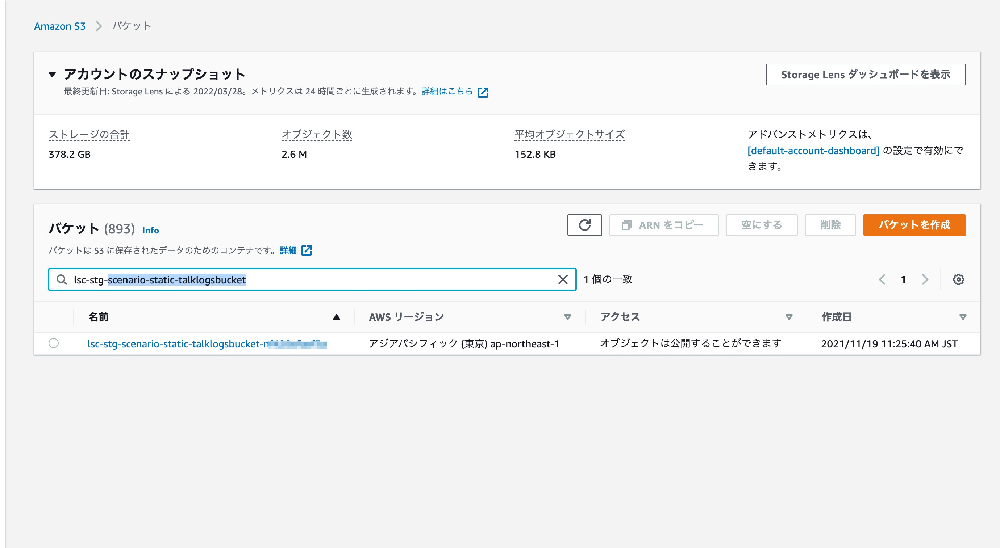
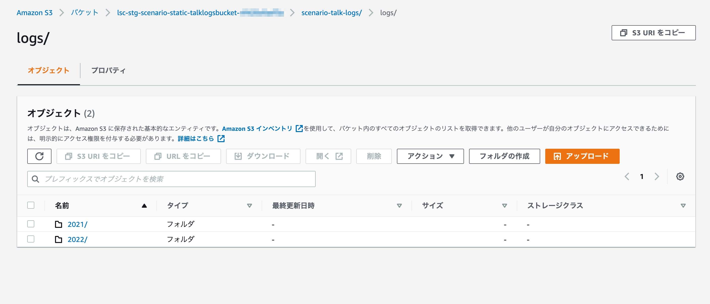
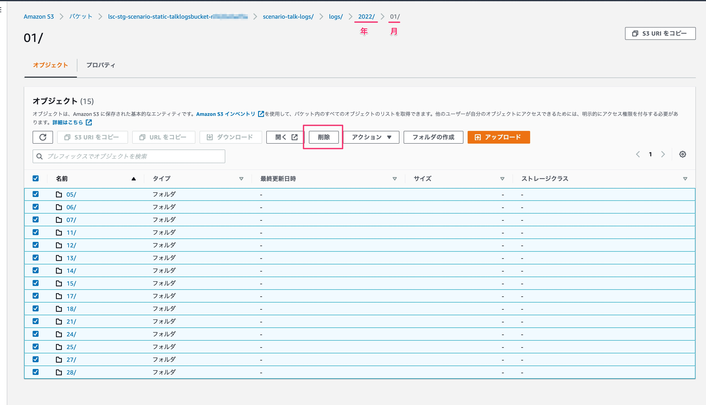
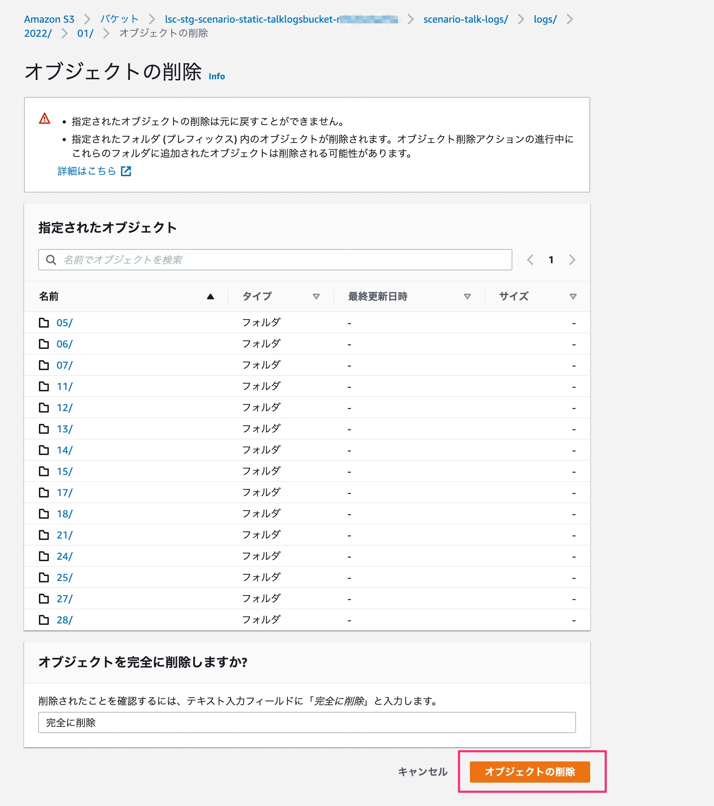
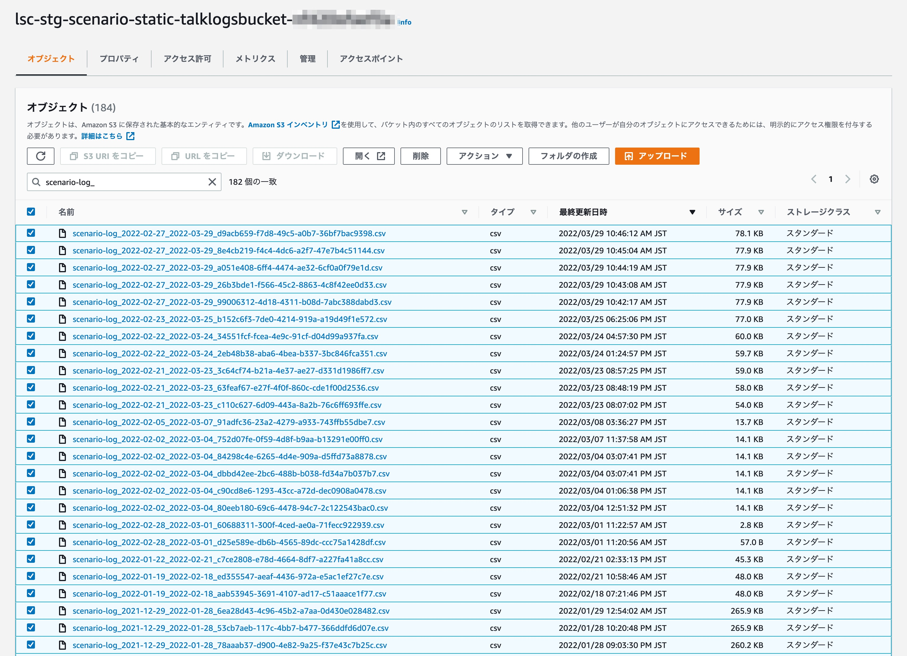
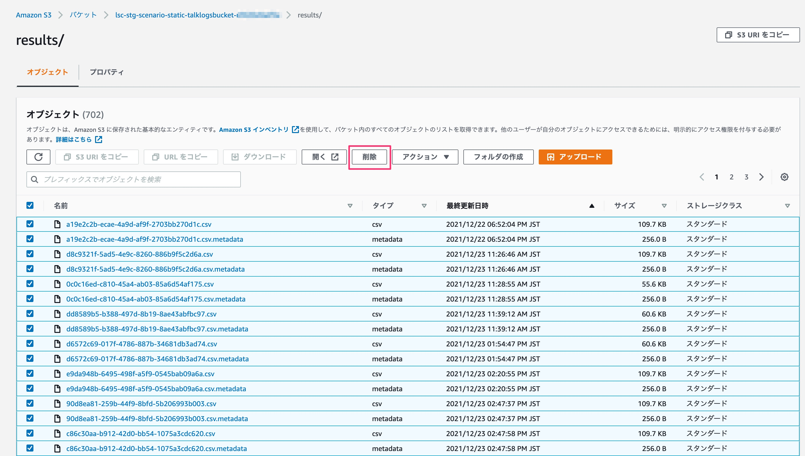

# トークログの削除について

1.20.0より、位置情報メッセージのトークログに住所情報が保存されないようになります。1.20.0以前のバージョンで既にトークログが保存されている場合、以下の手順にて削除ください。 

- [1. 過去のトークログデータの削除手順](#1-過去のトークログデータの削除手順)
- [2. ダウンロードリンク失効済CSVファイルの削除手順](#2-ダウンロードリンク失効済CSVファイルの削除手順)

## 1. 過去のトークログデータの削除手順

過去のトークログデータを削除する場合は、以下の手順で削除してください。

1. AWSにログインし、Amazon S3 コンソールにて、以下検索条件でバケットを検索する

    検索条件 : `<環境名>-scenario-static-talklogsbucket`
    

2. 該当バケットにアクセスし、`scenario-talk-logs` > `logs` フォルダに遷移する

    

3. 削除したいフォルダを選択し、「削除」を押下

    ログデータは 年 > 月 > 日 のフォルダ階層で格納されています。任意のフォルダ階層を選択して「削除」を押下してください。
    

4. オブジェクトの削除で、選択項目を確認のうえ「オブジェクトの削除」を選択する

    

## 2. ダウンロードリンク失効済CSVファイルの削除手順

ダウンロードリンク失効済CSVファイルを削除する場合は、以下の手順で削除してください。

### CSVファイルを削除する

1. AWSにログインし、Amazon S3 コンソールにて、以下検索条件でバケットを検索する

    検索条件 : `<環境名>-scenario-static-talklogsbucket`

2. 以下検索条件でバケット検索し、過去に生成されたCSVファイルを選択し「削除」を押下

    検索条件 : `scenario-log_`
    
    ※ トークログCSVのダウンロードリンクは15分で失効するため、最終更新日時が15分前以前のファイルは削除可能です

3. オブジェクトの削除で、選択項目を確認のうえ「オブジェクトの削除」を選択する

### CSVファイル生成に伴う中間データを削除する

1. AWSにログインし、Amazon S3 コンソールにて、以下検索条件でバケットを検索する

    検索条件 : `<環境名>-scenario-static-talklogsbucket`

2. 該当バケットにアクセスし、`results` フォルダに遷移する

3. ファイルをすべて削除して「削除」を押下。オブジェクトの削除で、選択項目を確認のうえ「オブジェクトの削除」を選択する

    
