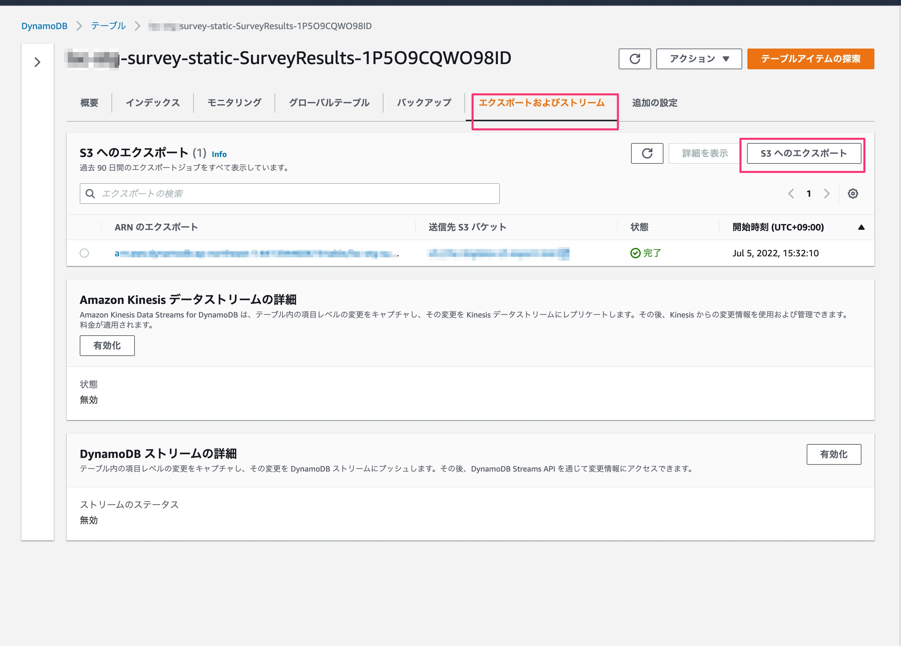
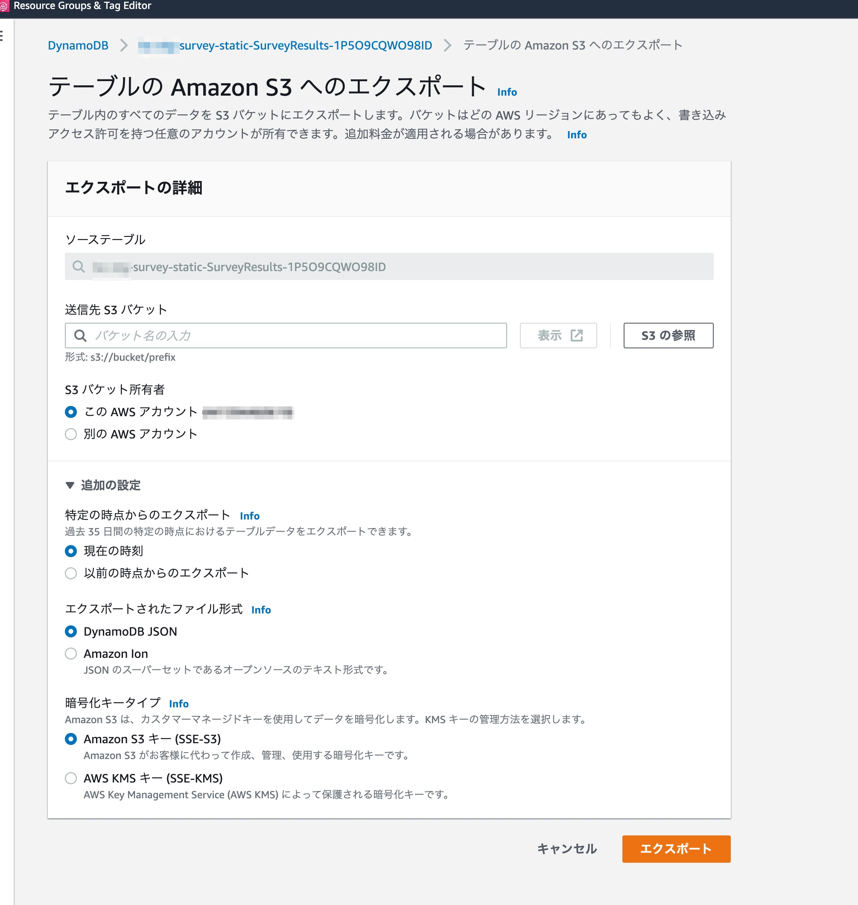
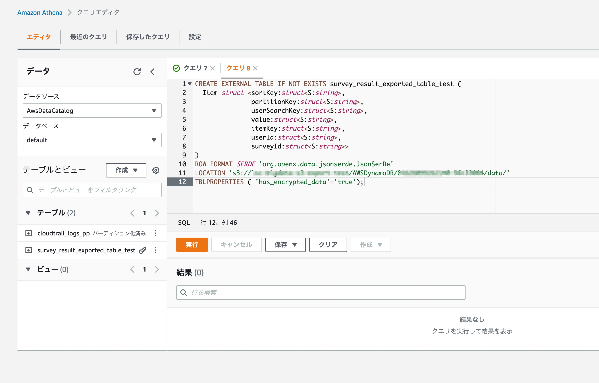
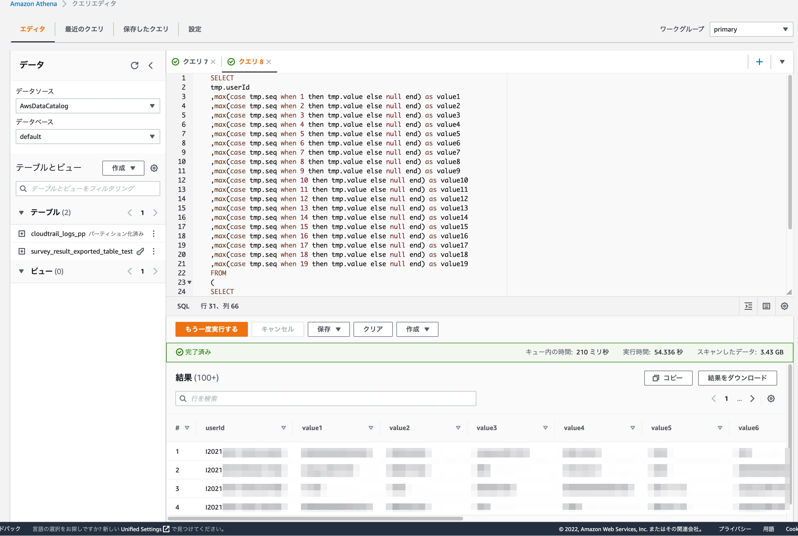

# 更新型帳票の回答データ出力方法
​
回答数が数千件以上ある更新型帳票の回答データは、管理画面「ホーム」タブのCSVエクスポート機能では出力する事ができません。  
以下の手順を参照して、AWSコンソールより回答データCSVを出力してください。

※ 追加型帳票の場合は、回答データが数千件以上でも管理画面「ホーム」タブのCSVエクスポートから出力可能です。

## 作業手順

### 1. DynamoDBの回答データレコードをS3に出力する

1. DynamoDB > 出力対象のSurveyResultテーブルにて、「エクスポートおよびストリーム」 > 「S3へのエクスポート」を押下

    

2. データ出力先のS3バケットを選択し、「エクスポート」を押下
    - 送信先S３バケット以外は初期値のまま

    


### 2. ​AWS Athenaに仮想テーブルを作成する

Amazon Athena > クエリエディタにて、以下のクエリを入力して「実行」

```
CREATE EXTERNAL TABLE IF NOT EXISTS survey_result_exported_table (
Item struct <sortKey:struct<S:string>,
            partitionKey:struct<S:string>,
            userSearchKey:struct<S:string>,
            value:struct<S:string>,
            itemKey:struct<S:string>,
            userId:struct<S:string>,
            surveyId:struct<S:string>>
)
ROW FORMAT SERDE 'org.openx.data.jsonserde.JsonSerDe'
LOCATION 's3://<S3バケット>/AWSDynamoDB/<ID>/data/'
TBLPROPERTIES ( 'has_encrypted_data'='true');
```

- `LOCATION`は、手順1でデータ出力先として指定したS3バケットへのパスです




### 3. ​AWS Athenaで回答レコードを出力する

1. Amazon Athena > クエリエディタにて、以下のようなクエリを入力して「実行」
    - 以下のクエリは、ユーザーが回答した回答のみをユーザー単位で横方向にまとめて出力するクエリです(質問項目の並びは順不同)
    - 任意の出力形態になるよう、クエリは適宜修正のうえご利用ください

    ```
    # 例
    SELECT
    tmp.userId
    ,max(case tmp.seq when 1 then tmp.value else null end) as value1
    ,max(case tmp.seq when 2 then tmp.value else null end) as value2
    ,max(case tmp.seq when 3 then tmp.value else null end) as value3
    ,max(case tmp.seq when 4 then tmp.value else null end) as value4
    ,max(case tmp.seq when 5 then tmp.value else null end) as value5
    ,max(case tmp.seq when 6 then tmp.value else null end) as value6
    ,max(case tmp.seq when 7 then tmp.value else null end) as value7
    ,max(case tmp.seq when 8 then tmp.value else null end) as value8
    ,max(case tmp.seq when 9 then tmp.value else null end) as value9
    ,max(case tmp.seq when 10 then tmp.value else null end) as value10
    ,max(case tmp.seq when 11 then tmp.value else null end) as value11
    ,max(case tmp.seq when 12 then tmp.value else null end) as value12
    ,max(case tmp.seq when 13 then tmp.value else null end) as value13
    ,max(case tmp.seq when 14 then tmp.value else null end) as value14
    ,max(case tmp.seq when 15 then tmp.value else null end) as value15
    ,max(case tmp.seq when 16 then tmp.value else null end) as value16
    ,max(case tmp.seq when 17 then tmp.value else null end) as value17
    ,max(case tmp.seq when 18 then tmp.value else null end) as value18
    ,max(case tmp.seq when 19 then tmp.value else null end) as value19
    FROM 
    (
    SELECT
        item.surveyid.S as surveyId,
        item.itemKey.S as itemKey,
        item.userid.S as userId,
        item.value.S as value,
        row_number() over (partition by item.userid.S) as seq
    FROM "default"."survey_result_exported_table"
    WHERE item.surveyid.S = '<任意の帳票ID>' AND item.value.S IS NOT null
    ) tmp
    GROUP BY
    tmp.userId
    ```

    


2. 「結果をダウンロード」を押下してCSVデータを出力