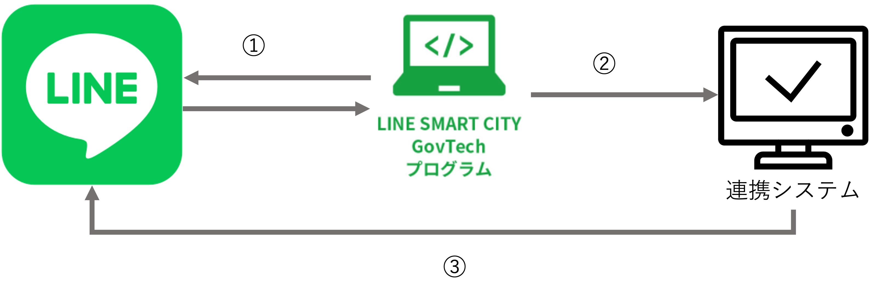
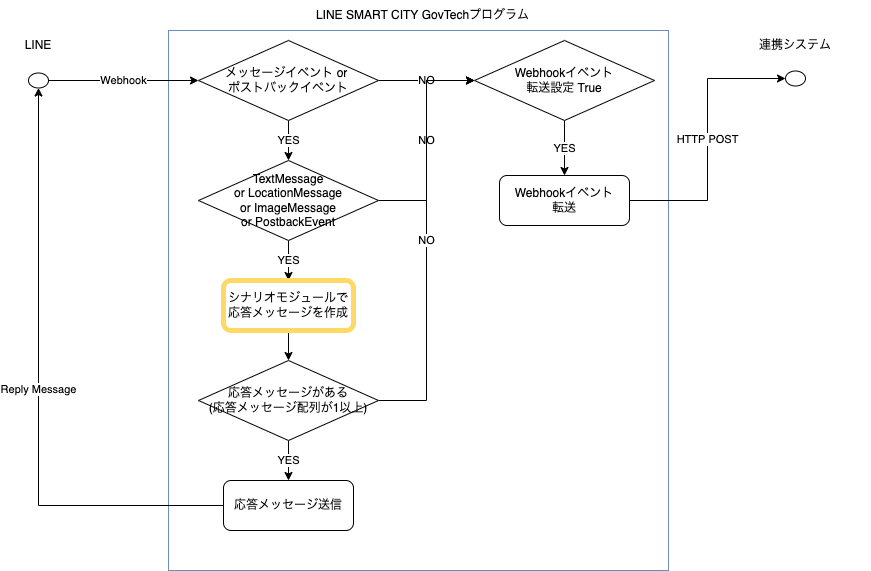
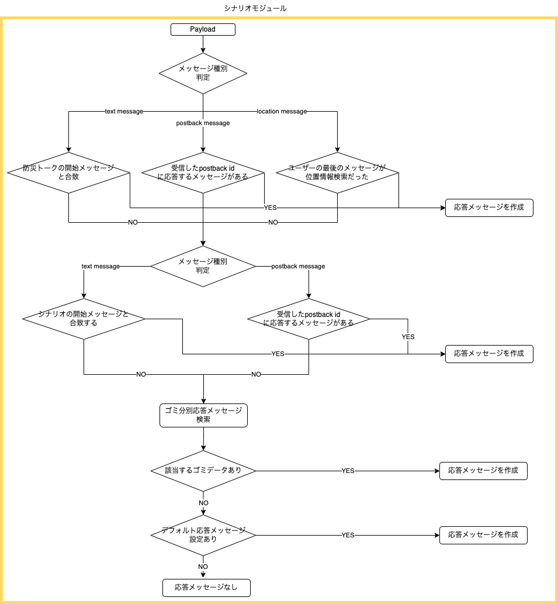

# LINE Messaging API転送機能

LINE Messaging API Webhookで受信したイベントのうち特定のイベントを、任意の連携システムに転送することができます。

## 目次

- [概要](#概要)
- [転送するイベントの条件](#転送するイベントの条件)
    - [転送するイベントタイプ](#転送するイベントタイプ)
- [データ転送処理について](#データ転送処理について)
    - [リクエストヘッダー](#リクエストヘッダー)
    - [リクエストボディ](#リクエストボディ)
    - [レスポンス](#レスポンス)
- [エラーの確認方法](#エラーの確認方法)

## 概要

- ① LINE DeveloperのMessaging API Webhook URLは、LINE SMART CITY GovTechプログラムの所定URLを設定する
- ② 特定のイベントを連携システムに転送する
    - `x-line-signature` を含む、LINE Messaging API Webhookと同等の形式で転送
- ③ 連携システムからメッセージを送信する場合は、連携システムからLINE Messaging APIを直接実行する

    

## 転送するイベントの条件

シナリオモジュールで応答メッセージを作成しないイベントが転送対象になります。  
条件判定のフローは以下の通りです。

| 全体処理フロー | シナリオモジュール内処理フロー |
| ------------ | ------------------------- |
|  |  |

### 転送するイベントタイプ

| イベントタイプ       | 転送条件 | 
| ----------------- | ----------------------- |
| ポストバックイベント | 応答メッセージがなければ転送 |
| アカウント連携イベント | 一律転送 |
| メンバー退出イベント | 一律転送 |
| 参加イベント | 一律転送 |
| デバイス連携イベント | 一律転送 |
| ビーコンイベント | 一律転送 |
| デバイス連携解除イベント | 一律転送 |
| LINE Thingsシナリオ実行イベント | 一律転送 |
| 送信取消イベント | 一律転送 |
| 退出イベント | 一律転送 |
| フォローイベント | 一律転送 |
| 動画視聴完了イベント | 一律転送 |
| メッセージイベント | 応答メッセージがなければ転送 |
| メンバー参加イベント | 一律転送 |
| フォロー解除イベント | 一律転送 |

## データ転送処理について

LINE Messaging API Webhookと同様、以下のデータを含むHTTP POSTリクエストを送信します。

### リクエストヘッダー

- `x-line-signature` 
    - 署名を付与します

署名の検証については、[Messaging APIリファレンス 署名を検証する](https://developers.line.biz/ja/reference/messaging-api/#signature-validation)を参照してください。

### リクエストボディ

Webhookイベントを受信すべきボットのユーザーIDとWebhookイベントオブジェクトの配列を含むJSONオブジェクトです。  
なお、Webhookイベントオブジェクトの配列には、[転送するイベントの条件](#転送するイベントの条件)を満たすイベントオブジェクトのみが含まれます。

リクエストボディの詳細については、[Messaging APIリファレンス リクエストボディ](https://developers.line.biz/ja/reference/messaging-api/#request-body)を参照してください。

### レスポンス

HTTP POSTリクエストを連携システムで受信したときは、10秒以内にステータスコード200を返してください。

## エラーの確認方法

連携システムへのWebhook送信は、以下のLambdaで実施します。  
転送状況や連携システムからの応答については、LambdaのCloudwatchログを確認してください。

- /aws/lambda/<環境名>-WebhookForwardFunction
    - 本番環境のMessaging APIチャネルにおけるWebhook送信処理
- /aws/lambda/<環境名>-WebhookForwardFunctionSandbox
    - サンドボックス環境のMessaging APIチャネルにおけるWebhook送信処理