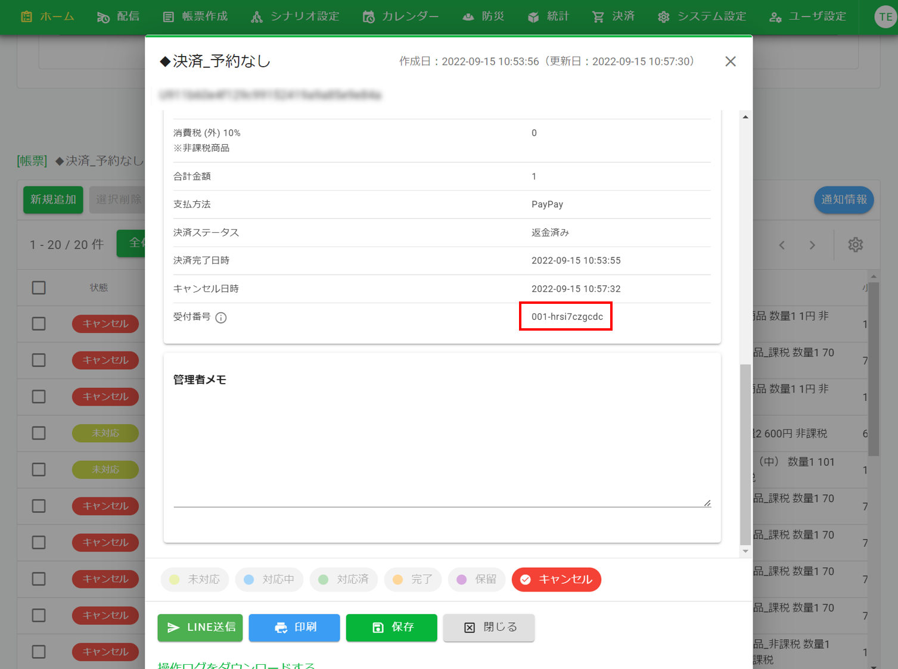
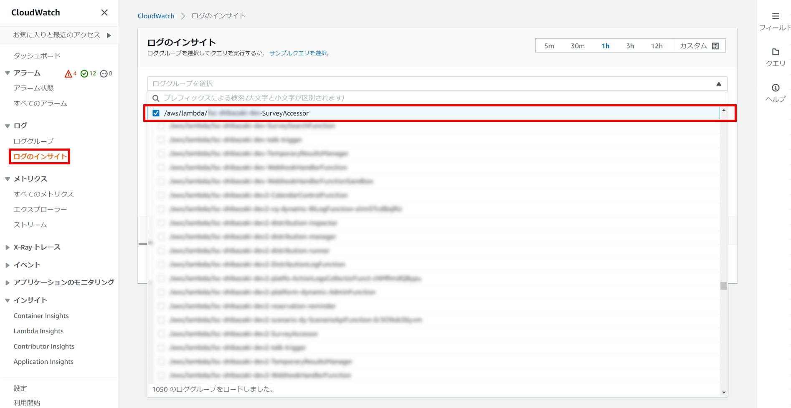
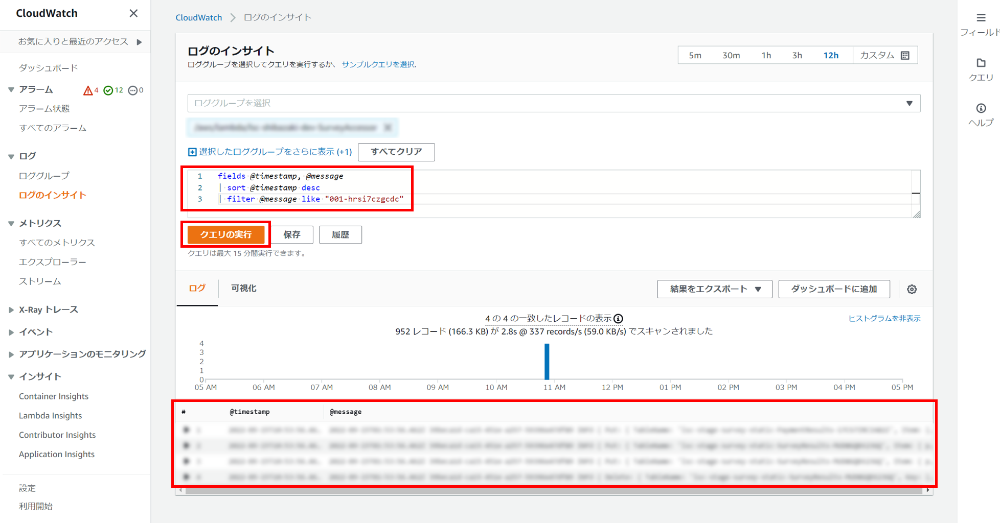

# 決済機能のログ確認
決済機能のログを確認したい場合は以下の手順を実施してください。

## CloudWatchによるログ確認方法
1. 管理画面にログインし、「ホーム」の検索結果から`受付番号`を確認し、クリップボードにコピーする等で控えを取ります。
  

2. AWSにログインし、CloudWatch > ログのインサイトにて、`/aws/lambda/環境名-SurveyAccessor`のロググループを選択します。
  

3. 以下のように検索条件を入力してから「クエリの実行」を押下すると一覧が表示され、ログの確認ができます。
※`like`の後の検索条件は「1」で控えを取った`受付番号`を入力します。
  