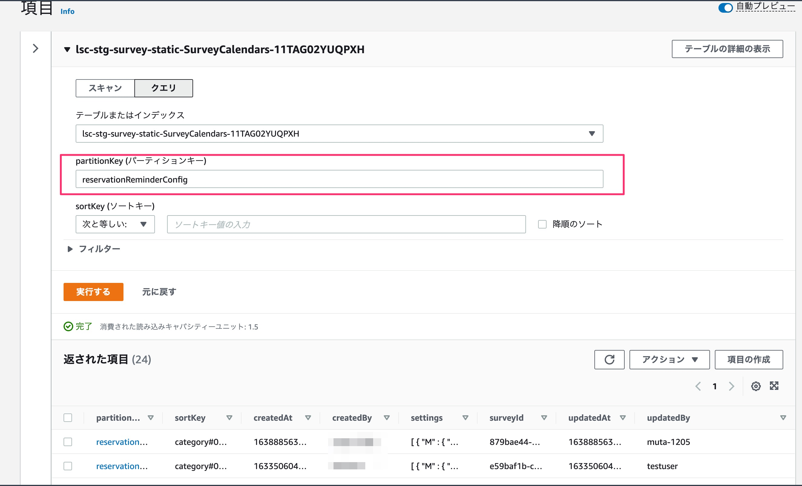
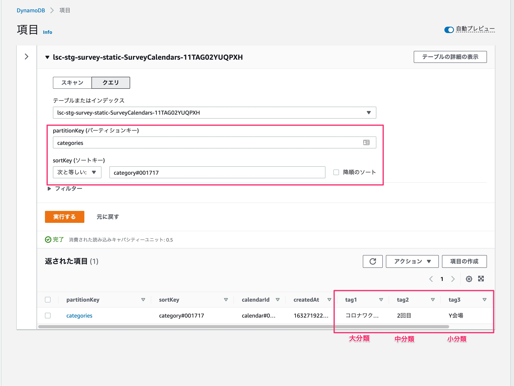
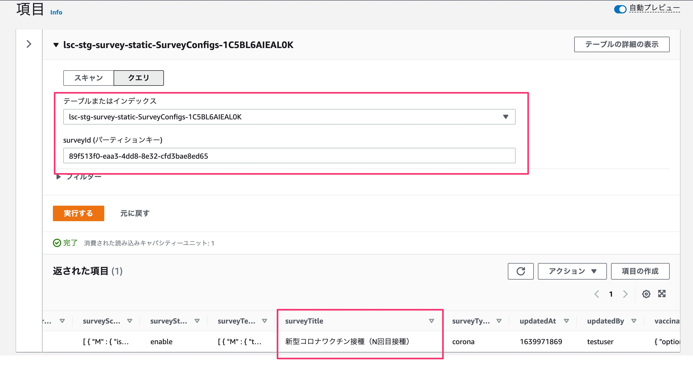

# 1.16.2以前の予約リマンド配信設定の確認方法

1.17.0の「予約リマンドのための自動配信機能」（以下、予約リマインド配信）の機能更新に伴い、 1.16.2以前に設定された予約リマインド配信の配信設定はアップデート後に無効になり、予約リマインド配信設定画面上でも非表示になります。

アップデート後に過去に設定された設定情報を確認する場合、以下の手順にて行ってください。

## 配信設定の確認手順

1. AWSにログインし、DynamoDB > SurveyCalendarsテーブルにて、以下検索条件でクエリ。予約リマインド配信設定を取得する

- partitionKey : `reservationReminderConfig`




2. 1の検索結果の`partitionKey`を押下しJSON形式で表示。以下を参考に配信設定の内容を確認する

```
{
  "partitionKey": {
    "S": "reservationReminderConfig"
  },
  "sortKey": {
    "S": "category#000XXXX"                     // 分類ID
  },
  "surveyId": {
    "S": "xxxxxxxx-xxxx-xxxx-xxxx-xxxxxxxx"     // 帳票ID
  },
  "settings": {
    "L": [
      {                                    // 1つめの配信設定
        "M": {
          "messages": {
            "L": [
              {                            // 1つめの配信設定 - 1通目のメッセージ
                "M": {
                  "type": {
                    "S": "text"
                  },
                  "text": {
                    "S": "ダミーメッセージ１-１"
                  }
                }
              },
              {                            // 1つめの配信設定 - 2通目のメッセージ
                "M": {
                  "type": {
                    "S": "text"
                  },
                  "text": {
                    "S": "ダミーメッセージ１−２"
                  }
                }
              }
            ]
          },
          "daysBefore": {                 // 1つめの配信設定 - 送信日(X日前) 
            "N": "1"
          },
          "sendTime": {                   // 1つめの配信設定 - 送信時刻
            "S": "12:00"
          }
        }
      },
      {                                   // 2つめの配信設定
        "M": {
          "messages": {
            "L": [
              {                           // 2つめの配信設定 - 1通目のメッセージ
                "M": {
                  "type": {
                    "S": "text"
                  },
                  "text": {
                    "S": "ダミーメッセージ２−１"
                  }
                }
              },
              {                           // 2つめの配信設定 - 2通目のメッセージ
                "M": {
                  "type": {
                    "S": "text"
                  },
                  "text": {
                    "S": "ダミーメッセージ２−３"
                  }
                }
              }
            ]
          },
          "daysBefore": {                 // 2つめの配信設定 - 送信日(X日前)
            "S": "1"
          },
          "sendTime": {                   // 2つめの配信設定 - 送信時刻
            "S": "12:00"
          }
        }
      }
    ]
  },
}
```


### 分類名の調査方法

DynamoDB > SurveyCalendarsテーブルにて、配信設定の`sortKey`(分類ID)から、予約リマインド配信設定が紐付けられた分類名を検索します

- partitionKey : `categories`
- sortKey : 各配信設定の`sortKey`




### 帳票名の調査方法

DynamoDB > SurveyConfigsテーブルにて、配信設定の`surveyId`(帳票ID)から、予約リマインド配信設定が紐付けられた帳票名を検索します

- partitionKey : 各配信設定の`surveyId`

